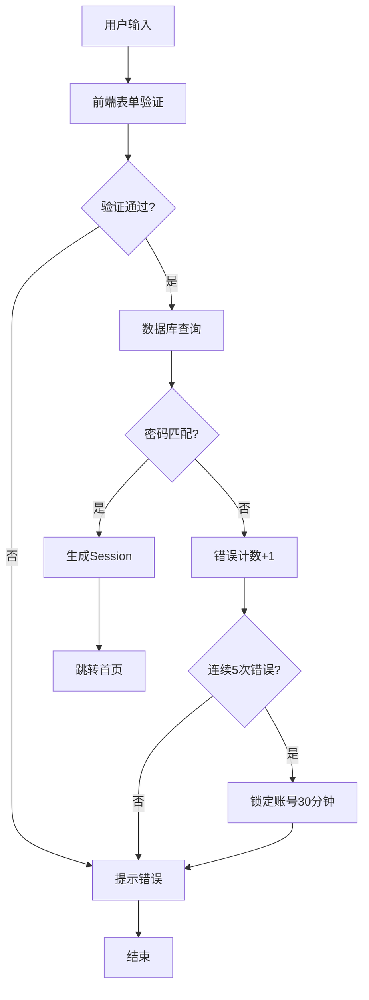
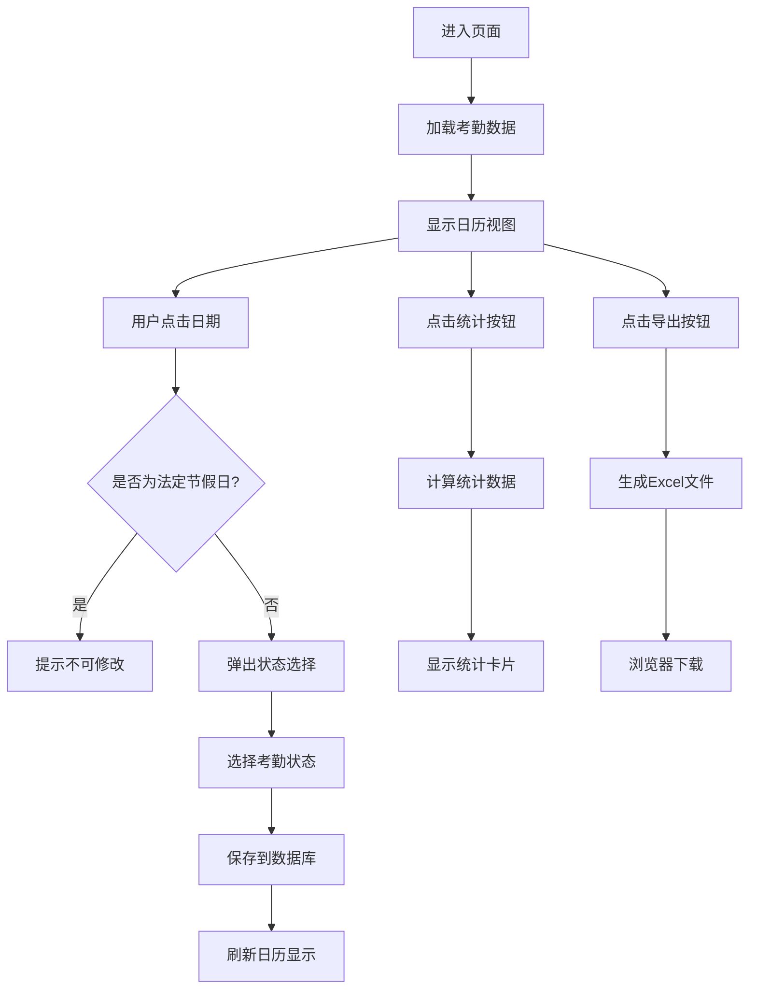
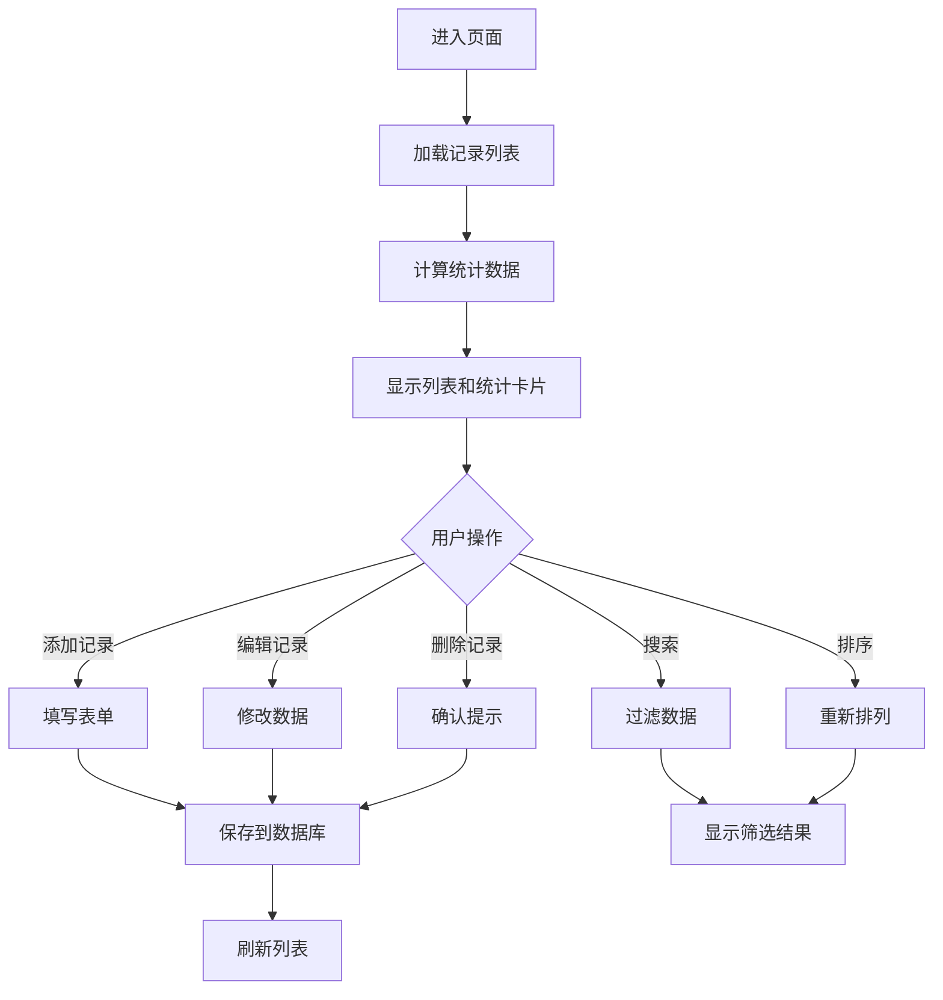
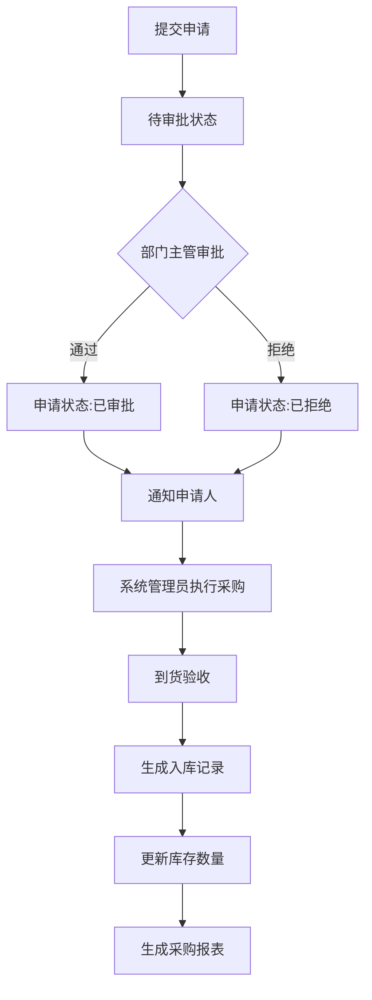
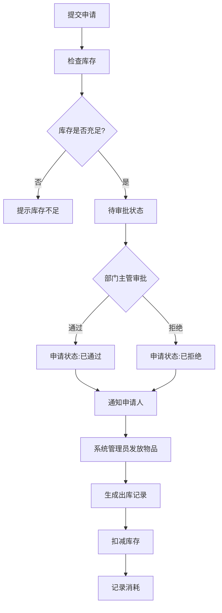
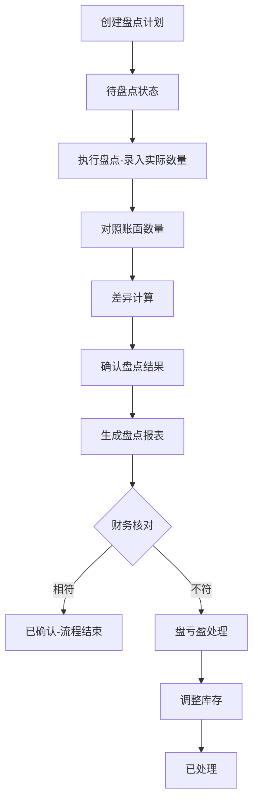

# 企业OA管理系统综合需求文档

## 文档信息

| 项目   | 内容                                  |
| ---- | ----------------------------------- |
| 系统名称 | 企业OA管理系统                         |
| 版本号  | V1.0                                |
| 创建日期 | 2026-04-11                          |
| 文档状态 | 初稿                                  |
| 基于文档 | 需求分析1.md（考勤和会餐费管理）、需求分析2.md（总务管理系统） |

***

## 1. 项目概述

### 1.1 系统背景

本系统是基于现代前端技术开发的OA管理平台，旨在为企业提供考勤管理、会餐费管理及总务管理的一站式解决方案。系统采用分期建设的模式：近期实现考勤管理和会餐费管理功能，中远期扩展至完整的总务管理系统。

**需求整合说明**：原需求分析1定位为OA平台的两个独立子模块，原需求分析2定位为独立的企业管理系统。本次整合将两者合并为一个统一的企业管理系统框架，考勤管理和会餐费管理作为第一期核心功能，总务管理系统其他功能作为未来扩展模块。

### 1.2 系统目标

- 实现企业日常考勤管理的数字化、规范化
- 实现会餐费管理的流程化、透明化
- 提高总务管理效率，减少人工操作失误
- 实现物品的精细化管理
- 提供准确的实时库存信息，支持最低库存预警
- 简化月度盘点流程，实现盘亏盘盈的有效管理
- 生成详细的管理报表，为决策提供数据支持

### 1.3 适用范围

适用于各类企事业单位的行政总务管理，可根据组织规模和需求进行灵活配置。

***

## 2. 用户角色定义

| 角色    | 职责               | 权限范围 |
| ----- | ---------------- | ---- |
| 系统管理员 | 负责系统日常操作和管理      | 全部功能 |
| 部门主管  | 负责审批采购申请、领取申请    | 审批功能 |
| 普通员工  | 提交采购申请、领取物品、考勤打卡 | 基础功能 |
| 财务人员  | 核对账目和盘点结果        | 财务相关 |

**新增说明**：本系统需支持多用户角色管理，原需求分析1未明确定义用户角色，本次整合参考需求分析2增加了完整的角色定义。

### 2.1 权限矩阵

| 功能模块 | 操作 | 系统管理员 | 部门主管 | 普通员工 | 财务人员 |
| -------- | ---- | :------: | :-----: | :-----: | :-----: |
| **考勤管理** | 查看自己的考勤 | ✅ | - | ✅ | - |
| | 修改自己的考勤 | ✅ | - | ✅ | - |
| | 查看所有员工考勤 | ✅ | - | - | - |
| | 导出考勤报表 | ✅ | - | - | - |
| **会餐费管理** | 查看会餐记录 | ✅ | - | ✅ | - |
| | 添加会餐记录 | ✅ | - | ✅ | - |
| | 编辑会餐记录 | ✅ | - | ✅ | - |
| | 删除会餐记录 | ✅ | - | - | - |
| **采购管理** | 提交采购申请 | ✅ | - | ✅ | - |
| | 审批采购申请 | ✅ | ✅ | - | - |
| | 执行采购 | ✅ | - | - | - |
| | 查看采购记录 | ✅ | ✅ | - | - |
| **物品管理** | 物品管理 | ✅ | - | - | - |
| **库存管理** | 查看库存 | ✅ | ✅ | ✅ | - |
| | 库存调整 | ✅ | - | - | - |
| **领取管理** | 提交领取申请 | ✅ | - | ✅ | - |
| | 审批领取申请 | ✅ | ✅ | - | - |
| | 发放物品 | ✅ | - | - | - |
| **盘点管理** | 创建盘点计划 | ✅ | - | - | - |
| | 执行盘点 | ✅ | - | - | - |
| | 核对盘点结果 | ✅ | - | - | ✅ |
| **系统管理** | 用户管理 | ✅ | - | - | - |
| | 部门管理 | ✅ | - | - | - |

### 2.2 初始用户

| 用户名 | 密码 | 角色 | 部门 |
| ---- | ---- | ---- | ---- |
| admin | admin123 | 系统管理员 | 行政部门 |
| manager | manager123 | 部门主管 | 行政部门 |
| user1 | user123 | 普通员工 | 行政部门 |
| finance | finance123 | 财务人员 | 财务部 |

***

## 3. 功能需求

### 3.1 考勤管理模块 【优先级：高 - 第一期】

| 需求ID    | 功能描述                                              | 需求来源  | 优先级 |
| ------- | ------------------------------------------------- | ----- | --- |
| ATT-001 | 月度考勤日历展示，支持按月份导航                                  | 需求分析1 | P0  |
| ATT-002 | 四种考勤状态标记：正常上班（实心圆）、全天休假（空心圆）、半天休假（半实心半空心圆）、加班（方框） | 需求分析1 | P0  |
| ATT-003 | 法定节假日默认标记（法定休假日标记为全天休假，法定工作日标记为全天上班）              | 需求分析1 | P0  |
| ATT-004 | 考勤统计功能，横向展开当月考勤明细                                 | 需求分析1 | P0  |
| ATT-005 | 考勤数据导出为Excel，使用符号标记考勤状态（正常上班●、全天休假○、半天休假◐、加班■） | 需求分析1 | P0  |
| ATT-006 | 支持查看所有账号的考勤结果                                     | 需求分析1 | P1  |

### 3.2 会餐费管理模块 【优先级：高 - 第一期】

| 需求ID    | 功能描述                               | 需求来源  | 优先级 |
| ------- | ---------------------------------- | ----- | --- |
| DNM-001 | 会餐记录的添加、编辑、删除                      | 需求分析1 | P0  |
| DNM-002 | 会餐记录列表展示，支持按日期、部门、参与人数、金额、用途、负责人排序 | 需求分析1 | P0  |
| DNM-003 | 日期范围和金额范围搜索功能                      | 需求分析1 | P0  |
| DNM-004 | 会餐费用统计（总记录数、总金额、平均金额）              | 需求分析1 | P0  |
| DNM-005 | 发票上传功能（非必填项），支持图片预览                | 需求分析1 | P0  |
| DNM-006 | 数据持久化存储                            | 需求分析1 | P0  |

### 3.3 物品管理模块 【优先级：中 - 第二期】

| 需求ID    | 功能描述                                     | 需求来源  | 优先级 |
| ------- | ---------------------------------------- | ----- | --- |
| ITM-001 | 物品分类管理：支持办公用品、消耗品、设备资产等分类                | 需求分析2 | P2  |
| ITM-002 | 物品信息维护：添加、编辑、删除物品信息，包括名称、规格、单位、分类、最低库存值等 | 需求分析2 | P2  |
| ITM-003 | 物品查询：支持按名称、分类、规格等条件查询                    | 需求分析2 | P2  |

### 3.4 采购管理模块 【优先级：中 - 第二期】

| 需求ID    | 功能描述                          | 需求来源  | 优先级 |
| ------- | ----------------------------- | ----- | --- |
| PUR-001 | 采购申请：普通员工提交采购申请，包括物品名称、数量、用途等 | 需求分析2 | P2  |
| PUR-002 | 采购审批：部门主管审批采购申请               | 需求分析2 | P2  |
| PUR-003 | 采购执行：总务管理员根据审批结果执行采购          | 需求分析2 | P2  |
| PUR-004 | 采购入库：采购物品入库，更新库存              | 需求分析2 | P2  |
| PUR-005 | 采购记录管理：查看历史采购记录               | 需求分析2 | P2  |

### 3.5 库存管理模块 【优先级：中 - 第二期】

| 需求ID    | 功能描述                        | 需求来源  | 优先级 |
| ------- | --------------------------- | ----- | --- |
| INV-001 | 实时库存查询：查看当前库存状态             | 需求分析2 | P2  |
| INV-002 | 库存预警：当物品库存达到最低值时，系统自动发送邮件提醒 | 需求分析2 | P2  |
| INV-003 | 库存调整：支持因特殊原因进行的库存调整         | 需求分析2 | P2  |
| INV-004 | 库存报表：生成库存状态报表               | 需求分析2 | P2  |

### 3.6 消耗管理模块 【优先级：低 - 第二期】

| 需求ID    | 功能描述                 | 需求来源  | 优先级 |
| ------- | -------------------- | ----- | --- |
| CNS-001 | 物品领取：员工领取物品，系统记录领取信息 | 需求分析2 | P3  |
| CNS-002 | 消耗记录：自动记录物品消耗情况      | 需求分析2 | P3  |
| CNS-003 | 消耗报表：生成物品消耗报表        | 需求分析2 | P3  |

### 3.7 盘点管理模块 【优先级：低 - 第二期】

| 需求ID   | 功能描述                     | 需求来源  | 优先级 |
| ------ | ------------------------ | ----- | --- |
| CK-001 | 盘点计划：制定月度盘点计划            | 需求分析2 | P3  |
| CK-002 | 盘点执行：总务管理员进行实际盘点，记录实际数量  | 需求分析2 | P3  |
| CK-003 | 盘亏盘盈处理：系统自动计算盘亏盘盈，生成盘点报表 | 需求分析2 | P3  |
| CK-004 | 盘点历史：查看历史盘点记录            | 需求分析2 | P3  |

***

## 4. 非功能需求

### 4.1 性能需求

| 需求项    | 指标要求           | 需求来源  |
| ------ | -------------- | ----- |
| 页面加载时间 | 不超过2秒          | 需求分析2 |
| 数据处理能力 | 支持并发100人同时操作   | 需求分析2 |
| 报表生成时间 | 复杂报表生成时间不超过10秒 | 需求分析2 |

### 4.2 安全性需求

| 需求项  | 指标要求                   | 需求来源  |
| ---- | ---------------------- | ----- |
| 用户认证 | 采用用户名和密码登录             | 需求分析2 |
| 权限控制 | 基于角色的权限管理，不同角色有不同的操作权限 | 需求分析2 |
| 数据备份 | 定期自动备份数据，防止数据丢失        | 需求分析2 |

### 4.3 可用性需求

| 需求项   | 指标要求               | 需求来源  |
| ----- | ------------------ | ----- |
| 系统可用性 | 99.9%以上            | 需求分析2 |
| 界面友好  | 操作简单直观，符合用户习惯      | 需求分析2 |
| 错误处理  | 提供友好的错误提示，帮助用户解决问题 | 需求分析2 |
| 响应式设计 | 适配不同设备的屏幕尺寸        | 需求分析1 |

***

## 5. 用户场景与业务流程

### 5.0 用户登录流程

#### 5.0.1 流程概述

用户登录流程是系统的入口，确保只有授权用户才能访问系统功能。系统采用基于角色的权限控制（RBAC），不同角色登录后看到不同的功能菜单。

#### 5.0.2 详细操作步骤

| 步骤 | 操作 | 参与者 | 系统响应 |
| ---- | ---- | ---- | ---- |
| 1 | 打开系统登录页面 | 用户 | 显示登录表单（用户名、密码输入框，登录按钮） |
| 2 | 输入用户名和密码 | 用户 | 验证输入框不为空 |
| 3 | 点击登录按钮 | 用户 | 提交登录请求 |
| 4 | 验证用户凭证 | 系统 | 查询数据库中的用户数据，匹配用户名和密码 |
| 5 | 验证成功 | 系统 | 创建Session，跳转至首页 |
| 6 | 验证失败 | 系统 | 显示错误提示"用户名或密码错误"，错误次数+1 |

#### 5.0.3 关键节点说明

- **用户数据存储**：用户信息存储在MySQL数据库的user表中
- **Session管理**：使用Session/Cookie存储登录状态，包含用户ID、角色、登录时间
- **密码错误锁定**：连续5次错误，锁定账号30分钟，锁定时间存储在用户记录中

#### 5.0.4 数据流转路径



#### 5.0.5 异常处理

| 异常场景 | 处理机制 | 提示信息 |
| -------- | ---- | ---- |
| 用户名为空 | 阻止提交 | "请输入用户名" |
| 密码为空 | 阻止提交 | "请输入密码" |
| 用户名不存在 | 显示错误 | "用户名或密码错误" |
| 密码错误 | 显示错误 | "用户名或密码错误"，错误次数+1 |
| 账号已锁定 | 显示提示 | "账号已锁定，请30分钟后重试" |
| 首次登录 | 跳转修改密码页 | 无提示，直接跳转 |

#### 5.0.6 登录页面元素

- 用户名输入框（placeholder: 请输入用户名）
- 密码输入框（placeholder: 请输入密码）
- 登录按钮（文本：登录）
- 记住密码复选框（可选，默认不勾选）

### 5.1 考勤管理流程

#### 5.1.1 流程概述

考勤管理流程用于记录和管理员工的日常考勤状态，包括上班、休假、加班等情况。系统支持按月查看日历视图，自动标记法定节假日，并提供统计和导出功能。

#### 5.1.2 详细操作步骤

| 步骤 | 操作 | 参与者 | 系统响应 |
| ---- | ---- | ---- | ---- |
| 1 | 进入考勤管理页面 | 员工/管理员 | 默认显示当月考勤日历 |
| 2 | 首次加载考勤数据 | 系统 | 检查数据库，有数据则显示，无数据则初始化默认状态 |
| 3 | 查看考勤日历 | 员工/管理员 | 展示当月每天的考勤状态（符号标记） |
| 4 | 点击具体日期 | 员工/管理员 | 弹出考勤状态选择弹窗 |
| 5 | 选择考勤状态 | 员工/管理员 | 更新该日期的考勤状态 |
| 6 | 保存考勤记录 | 系统 | 将考勤数据保存到数据库 |
| 7 | 查看考勤统计 | 员工/管理员 | 横向展开当月统计明细 |
| 8 | 导出考勤Excel | 管理员 | 生成并下载Excel文件 |

#### 5.1.3 关键节点说明

- **默认状态**：首次使用时，所有工作日默认标记为"正常上班"，休息日默认标记为"全天休假"
- **法定节假日**：系统自动从内置JSON读取当年节假日数据，标记为"全天休假"，不可手动修改
- **考勤符号**：正常上班(●)、全天休假(○)、半天休假(◐)、加班(■)
- **修改权限**：普通员工只能修改当日及之前7天内的考勤；管理员可修改任意日期
- **数据存储**：按用户ID和月份存储，存储在MySQL数据库的attendance表中

#### 5.1.4 数据流转路径



#### 5.1.5 异常处理

| 异常场景 | 处理机制 | 提示信息 |
| -------- | ---- | ---- |
| 点击法定节假日 | 弹出提示并阻止修改 | "法定节假日不可修改" |
| 超出修改期限 | 阻止修改 | "只能修改7天内的考勤记录" |
| 非管理员查看他人考勤 | 阻止访问 | 无提示，直接跳转或提示"无权限" |
| 数据加载失败 | 显示错误提示 | "考勤数据加载失败，请刷新重试" |
| Excel导出失败 | 显示错误提示 | "导出失败，请重试" |

#### 5.1.6 特殊规则

- **法定节假日数据来源**：系统内置当年法定节假日JSON数据，每年末自动更新下一年数据
- **考勤状态符号**：正常上班(●)、全天休假(○)、半天休假(◐)、加班(■)
- **统计内容**：出勤天数、休假天数、加班天数、请假天数

### 5.2 会餐费管理流程

#### 5.2.1 流程概述

会餐费管理流程用于记录企业内部的会餐费用支出，包括添加、编辑、删除会餐记录，以及搜索、排序和统计功能。发票上传为非必填项。

#### 5.2.2 详细操作步骤

| 步骤 | 操作 | 参与者 | 系统响应 |
| ---- | ---- | ---- | ---- |
| 1 | 进入会餐费管理页面 | 员工/管理员 | 默认显示会餐记录列表（按日期倒序） |
| 2 | 查看统计卡片 | 系统 | 页面顶部显示总记录数、总金额、平均金额 |
| 3 | 点击"添加会餐记录" | 员工/管理员 | 弹出填写表单 |
| 4 | 填写会餐信息 | 员工/管理员 | 填写日期、部门、参与人数、金额、用途、负责人 |
| 5 | 上传发票图片（可选） | 员工/管理员 | 选择图片文件并上传预览 |
| 6 | 点击保存 | 员工/管理员 | 保存到数据库，返回列表页 |
| 7 | 编辑/删除记录 | 员工/管理员 | 操作后刷新列表 |
| 8 | 使用搜索器筛选 | 员工/管理员 | 按日期范围或金额范围筛选 |
| 9 | 排序记录 | 员工/管理员 | 按选择字段排序 |

#### 5.2.3 关键节点说明

- **数据存储**：每条记录有唯一ID，存储在MySQL数据库的dinner_record表中
- **排序字段**：日期、部门、参与人数、金额、用途、负责人
- **排序方式**：升序/降序切换
- **搜索方式**：日期范围搜索（开始日期+结束日期）、金额范围搜索（最小金额+最大金额）
- **发票存储**：图片转为Base64存储，或存储图片路径

#### 5.2.4 数据流转路径



#### 5.2.5 异常处理

| 异常场景 | 处理机制 | 提示信息 |
| -------- | ---- | ---- |
| 必填字段为空 | 阻止提交 | "请填写XX字段" |
| 金额格式错误 | 阻止提交 | "请输入有效金额" |
| 日期格式错误 | 阻止提交 | "请选择有效日期" |
| 图片格式不支持 | 阻止上传 | "仅支持jpg、png格式" |
| 图片过大 | 压缩或提示 | "图片过大，请压缩后上传" |
| 删除记录 | 二次确认 | "确定要删除这条记录吗？" |

#### 5.2.6 数据规则

- **金额范围搜索**：支持设置最小金额和最大金额
- **日期范围搜索**：支持设置开始日期和结束日期
- **排序功能**：支持按日期、部门、参与人数、金额、用途、负责人升序/降序排列
- **发票要求**：非必填，支持jpg/png格式，大小不超过2MB

### 5.3 采购流程（第二期）

#### 5.3.1 流程概述

采购流程用于管理办公物品的采购申请、审批、执行和入库。普通员工提交采购申请，部门主管审批，系统管理员执行采购并入库。

#### 5.3.2 详细操作步骤

| 步骤 | 操作 | 参与者 | 系统响应 |
| ---- | ---- | ---- | ---- |
| 1 | 提交采购申请 | 普通员工 | 填写物品名称、申请数量、用途、期望交付日期 |
| 2 | 审批采购申请 | 部门主管 | 查看申请详情，选择通过/拒绝 |
| 3 | 通过审批 | 部门主管 | 申请状态变为"已审批"，通知申请人 |
| 4 | 拒绝审批 | 部门主管 | 申请状态变为"已拒绝"，记录拒绝原因，通知申请人 |
| 5 | 执行采购 | 系统管理员 | 填写供应商、采购价格、订单号、预计交付日期 |
| 6 | 到货验收 | 系统管理员 | 确认实际到货数量，生成入库记录 |
| 7 | 更新库存 | 系统 | 库存数量增加 |
| 8 | 生成报表 | 系统 | 记录采购信息，可生成采购报表 |

#### 5.3.3 关键节点说明

- **申请状态**：待审批、已审批、已拒绝、已采购、已完成
- **审批时限**：建议3个工作日内完成审批
- **入库记录**：包含物品ID、入库数量、入库日期、操作人
- **库存更新**：采购入库后，系统库存自动增加相应数量

#### 5.3.4 数据流转路径



#### 5.3.5 异常处理

| 异常场景 | 处理机制 | 提示信息 |
| -------- | ---- | ---- |
| 审批拒绝 | 系统自动通知申请人 | "您的采购申请已被拒绝，原因：XX" |
| 库存不足时 | 系统提示库存不足 | "当前库存不足，是否继续执行？" |
| 超预算申请 | 系统标记超预算提醒 | "该申请超出预算，请确认是否批准" |
| 供应商无法供货 | 管理员手动调整 | "供应商无法供货，请重新选择或执行采购" |
| 到货数量不足 | 记录差异数量 | "实际到货数量与订单不符，请核实" |

#### 5.3.6 审批规则

- 采购金额500元以下：部门主管审批即可
- 采购金额500-2000元：部门主管审批，必要时上级审批
- 采购金额2000元以上：需多级审批

### 5.4 领取流程（第二期）

#### 5.4.1 流程概述

领取流程用于管理员工领取办公物品。员工提交领取申请，部门主管审批，系统管理员发放物品，系统自动记录消耗并更新库存。

#### 5.4.2 详细操作步骤

| 步骤 | 操作 | 参与者 | 系统响应 |
| ---- | ---- | ---- | ---- |
| 1 | 提交领取申请 | 普通员工 | 填写物品名称、领取数量、用途 |
| 2 | 检查库存 | 系统 | 显示物品当前库存和可领取数量 |
| 3 | 审批领取申请 | 部门主管 | 查看申请详情，检查库存，选择通过/拒绝 |
| 4 | 通过审批 | 部门主管 | 申请状态变为"已通过"，通知申请人 |
| 5 | 拒绝审批 | 部门主管 | 申请状态变为"已拒绝"，记录拒绝原因，通知申请人 |
| 6 | 发放物品 | 系统管理员 | 确认实际发放数量 |
| 7 | 记录出库 | 系统 | 生成出库记录，库存扣减 |
| 8 | 消耗记录 | 系统 | 自动将本次领取计入消耗记录 |

#### 5.4.3 关键节点说明

- **领取状态**：待审批、已通过、已拒绝、已发放
- **领取限制**：单人单次领取上限为该物品最低库存的50%，月度领取上限为最低库存的200%
- **库存检查**：提交申请时检查库存，库存不足时无法提交
- **消耗记录**：自动记录领取人、物品、数量、日期

#### 5.4.4 数据流转路径



#### 5.4.5 异常处理

| 异常场景 | 处理机制 | 提示信息 |
| -------- | ---- | ---- |
| 库存不足 | 阻止提交 | "库存不足，当前库存：XX" |
| 超出领取限制 | 提示限制 | "超出领取上限，单次最多XX，月度最多XX" |
| 审批拒绝 | 系统自动通知申请人 | "您的领取申请已被拒绝，原因：XX" |
| 实际发放少于申请 | 调整数量 | "实际发放XX，是否确认？" |

#### 5.4.6 领取规则

- **单次上限**：该物品最低库存的50%
- **月度上限**：该物品最低库存的200%
- **优先级的**：有库存时按申请时间先后发放

### 5.5 盘点流程（第二期）

#### 5.5.1 流程概述

盘点流程用于定期核对系统库存与实际库存是否一致。系统管理员创建盘点计划，进行实际盘点，系统自动计算盘亏盘盈，财务人员核对确认。

#### 5.5.2 详细操作步骤

| 步骤 | 操作 | 参与者 | 系统响应 |
| ---- | ---- | ---- | ---- |
| 1 | 创建盘点计划 | 系统管理员 | 设定盘点开始日期、结束日期、盘点范围 |
| 2 | 执行盘点 | 系统管理员 | 逐一录入每种物品的实际数量 |
| 3 | 对照账面数量 | 系统 | 自动显示当前账面数量供对照参考 |
| 4 | 差异计算 | 系统 | 自动计算盘亏盘盈数量（实际数量 - 账面数量） |
| 5 | 确认结果 | 系统管理员 | 确认盘点结果，如有差异需填写差异原因说明 |
| 6 | 生成报表 | 系统 | 生成盘点报表，记录盘点时间、参与人、差异明细 |
| 7 | 财务核对 | 财务人员 | 核对盘点结果，确认账实相符或不符 |
| 8 | 盘亏盈处理 | 管理员 | 批准后，系统自动调整库存至实际数量 |

#### 5.5.3 关键节点说明

- **盘点状态**：待盘点、盘点中、已确认、已处理
- **盘点范围**：全量盘点或部分物品盘点
- **账面数量**：系统当前记录的库存数量
- **实际数量**：现场实际清点的数量
- **差异原因**：盘亏需填写原因（人为损坏、盗窃、自然损耗等）

#### 5.5.4 数据流转路径



#### 5.5.5 异常处理

| 异常场景 | 处理机制 | 提示信息 |
| -------- | ---- | ---- |
| 盘亏金额较大 | 需上级审批 | "盘亏金额超过XX，需上级审批" |
| 差异原因不明 | 提示填写原因 | "请填写差异原因说明" |
| 财务人员不确认 | 退回重盘 | "盘点结果有误，请重新盘点" |
| 漏盘物品 | 提示补盘 | "有XX种物品未盘点，是否继续？" |

#### 5.5.6 盘亏盈处理规则

- **盘亏**：经批准后，系统自动调整库存至实际数量，记录盘亏原因
- **盘盈**：经批准后，系统自动调整库存至实际数量，记录盘盈原因
- **无差异**：盘点结果标记为"已确认"，流程结束
- **盘点周期**：建议每月进行一次全量盘点

***

## 6. 界面设计

### 6.1 整体布局

- 顶部导航栏：系统名称、用户信息、退出登录
- 左侧菜单：功能模块导航
- 右侧主内容区：具体功能操作和数据展示

### 6.2 主要页面

**第一期页面**：

- 考勤管理页面：月度考勤日历视图、月份导航按钮、统计按钮、导出按钮
- 会餐费管理页面：记录列表、添加表单、搜索表单、统计卡片

**第二期页面**（待开发）：

- 物品管理页面：物品列表、添加/编辑物品
- 采购管理页面：采购申请、采购订单、入库记录
- 库存管理页面：库存列表、库存预警、库存调整
- 消耗管理页面：领取申请、领取记录、消耗报表
- 盘点管理页面：盘点计划、盘点执行、盘点报表
- 报表页面：各类报表查询和导出

### 6.3 界面风格

- 简洁明了：采用简洁的设计风格，减少视觉干扰
- 一致性：保持界面元素的一致性，便于用户操作
- 响应式：支持不同设备的屏幕尺寸
- 色彩方案：使用专业的商务色彩，如蓝色、灰色等

***

## 7. 技术架构

### 7.1 前端技术栈

| 技术 | 版本 | 说明 |
| ---- | --- | ---- |
| Vue | 3.x | 渐进式前端框架 |
| Element Plus | 最新版本 | 基于 Vue 3 的组件库 |
| axios | 最新版本 | HTTP 请求库 |
| Vite | - | 构建工具 |

### 7.2 后端技术栈

| 技术 | 说明 |
| ---- | ---- |
| Spring Boot | 快速构建Spring应用 |
| Spring MVC | Web层框架 |
| Spring Security | 安全框架 |
| MyBatis | 持久层框架 |
| MySQL | 关系型数据库 |

### 7.3 数据存储

- **数据库**：MySQL 8.0+
- **持久化方案**：MySQL数据库存储

### 7.4 系统架构图

```
┌─────────────────────────────────────────┐
│              前端 (Vue 3)                 │
│  ┌─────────┐  ┌──────────┐  ┌────────┐ │
│  │考勤管理 │  │会餐费管理│  │总务管理│ │
│  └────┬────┘  └────┬───┘  └───┬──┘ │
│       │            │          │        │
│       └────────────┼──────────┘        │
│                  │                   │
│            ┌─────┴─────┐             │
│            │  axios   │              │
│            └─────┬─────┘             │
└──────────────────┼───────────────────┘
                   │ HTTP
┌──────────────────┼───────────────────┐
│                  │   后端 (Spring Boot)│
│            ┌─────┴─────┐             │
│            │ Controller│            │
│            └─────┬─────┘             │
│                  │                   │
│            ┌─────┴─────┐             │
│            │ Service  │              │
│            └─────┬─────┘             │
│                  │                   │
│            ┌─────┴─────┐             │
│            │ Mapper   │              │
│            └─────┬─────┘             │
│                  │                   │
│       ┌──────────┴──────────┐       │
│       │                      │       │
│ ┌─────┴─────┐
│ │MySQL      │
│ └───────────┘
└─────────────────────────────────────┘
```

### 7.5 项目结构

**前端项目结构**：
```
src/
├── assets/          # 静态资源
├── components/     # 公共组件
├── views/          # 页面视图
├── router/         # 路由配置
├── api/            # API接口
├── utils/          # 工具函数
└── App.vue         # 根组件
```

**后端项目结构**：
```
src/main/java/
├── controller/    # 控制器
├── service/       # 业务层
├── mapper/        # 持久层
├── entity/        # 实体类
├── dto/           # 数据传输对象
└── Application   # 启动类
```

### 7.6 API接口设计（第一期）

**通用说明**：
- 请求Content-Type：application/json
- 响应格式：`{ "code": 200, "data": {}, "message": "success" }`
- 第一期URL前缀：/api/v1

#### 考勤模块

| 方法 | 路径 | 说明 | 权限 |
| ---- | ---- | ---- | ---- |
| GET | /attendance/month/{year}/{month} | 获取月度考勤 | 员工/管理员 |
| POST | /attendance | 标记考勤 | 员工/管理员 |
| GET | /attendance/statistics/{year}/{month} | 考勤统计 | 员工/管理员 |
| GET | /attendance/export/{year}/{month} | 导出考勤Excel | 管理员 |

#### 会餐费模块

| 方法 | 路径 | 说明 | 权限 |
| ---- | ---- | ---- | ---- |
| GET | /dinner | 会餐记录列表 | 员工/管理员 |
| POST | /dinner | 添加会餐记录 | 员工/管理员 |
| PUT | /dinner/{id} | 编辑会餐记录 | 员工/管理员 |
| DELETE | /dinner/{id} | 删除会餐记录 | 管理员 |
| GET | /dinner/statistics | 会餐费用统计 | 员工/管理员 |
| POST | /dinner/upload | 上传发票图片 | 员工/管理员 |

#### 认证模块

| 方法 | 路径 | 说明 | 权限 |
| ---- | ---- | ---- | ---- |
| POST | /auth/login | 用户登录 | 公开 |
| POST | /auth/logout | 用户登出 | 登录用户 |
| GET | /auth/current | 获取当前用户信息 | 登录用户 |

***

## 8. 项目规划

### 8.1 项目阶段

| 阶段  | 功能范围           | 预计周期 |
| --- | -------------- | ---- |
| 第一期 | 考勤管理、会餐费管理     | -    |
| 第二期 | 物品管理、采购管理、库存管理 | -    |
| 第三期 | 消耗管理、盘点管理、报表功能 | -    |

### 8.2 风险管理

- 需求变更：建立需求变更管理流程，控制变更范围
- 技术风险：选择成熟的技术栈，进行充分的技术评估
- 时间风险：制定详细的项目计划，定期跟踪进度
- 质量风险：建立质量保证体系，进行充分的测试

***

## 9. 验收标准

### 9.1 考勤管理模块验收标准

- [ ] 支持按月份查看考勤日历
- [ ] 可以标记四种考勤状态
- [ ] 法定节假日自动标记
- [ ] 可以查看考勤统计
- [ ] 可以导出Excel文件
- [ ] 可以查看所有用户的考勤记录

### 9.2 会餐费管理模块验收标准

- [ ] 可以添加、编辑、删除会餐记录
- [ ] 列表支持多种排序方式
- [ ] 支持日期和金额范围搜索
- [ ] 显示统计信息
- [ ] 支持上传和预览发票图片
- [ ] 数据持久化存储

### 9.3 系统整体验收标准

- [ ] 页面加载时间不超过2秒
- [ ] 界面风格统一、响应式
- [ ] 支持多用户角色权限
- [ ] 数据备份正常

***

## 10. 合并说明与决策记录

### 10.1 整合决策

| 序号 | 决策项   | 原方案                            | 调整后方案            | 理由        |
| -- | ----- | ------------------------------ | ---------------- | --------- |
| 1  | 系统定位  | OA平台子模块 + 独立系统                 | 统一的企业管理系统        | 便于统一规划和扩展 |
| 2  | 用户角色  | 未明确定义                          | 定义4种角色           | 满足权限控制需求  |
| 3 | 存储方案 | 需求分析1: localStorage；需求分析2: 未指定 | 统一使用MySQL数据库 | 符合技术选型 |
| 4  | 功能优先级 | 未区分                            | 分三期优先级           | 明确开发重点    |

### 10.2 冲突解决

- 系统目标冲突：通过将两个系统定位合并为一个分期建设框架解决
- 存储方案差异：统一采用MySQL数据库

### 10.3 内容保留

所有关键需求点均已保留：

- 考勤管理6项功能全部保留
- 会餐费管理6项功能全部保留
- 总务管理系统6大模块作为未来扩展

### 10.4 模糊表述补充

- 技术栈部分：保持待补充状态，待技术选型后填写
- 组件结构：保持待补充状态，待架构设计后填写

***

## 11. 后续优化方向

1. 添加用户认证系统，支持多用户登录
2. 实现数据同步到后端服务器，确保数据安全
3. 增加更多统计分析功能，如部门会餐费用对比
4. 优化发票上传功能，支持PDF格式和批量上传
5. 添加审批流程，实现会餐费用的审批功能
6. 增加数据备份和恢复功能
7. 添加移动端应用支持

***

## 12. 总结

本综合需求文档整合了需求分析1.md（考勤和会餐费管理）和需求分析2.md（总务管理系统）的全部功能需求，形成了完整的企业管理系统的需求规格说明。

文档统一了系统定位，明确了用户角色，区分了功能优先级，保留了所有关键需求点，并为未来的扩展预留了空间。系统采用分期建设的模式，第一期着重实现考勤管理和会餐费管理两个核心模块，确保快速交付实际价值。

***

## 13. 术语表

| 术语 | 说明 |
| ---- | ---- |
| P0 | 最高优先级，必须实现 |
| P1 | 高优先级，应该实现 |
| P2 | 中优先级，可以实现 |
| P3 | 低优先级，未来实现 |
| OA | 办公自动化（Office Automation） |
| API | 应用程序编程接口 |
| CRUD | 增删改查（Create/Read/Update/Delete） |
| 盘亏 | 实际库存少于账面库存 |
| 盘盈 | 实际库存多于账面库存 |
| 法定节假日 | 国家规定的节假日 |

***

## 14. 参考资料

1. 需求分析1.md（考勤和会餐费管理）
2. 需求分析2.md（总务管理系统）
3. Element Plus 官方文档
4. Spring Boot 官方文档

***

**文档变更记录**

| 版本   | 日期         | 修改内容 | 修改人    |
| ---- | ---------- | ---- | ------ |
| V1.0 | 2026-04-11 | 初始版本 | Claude |

