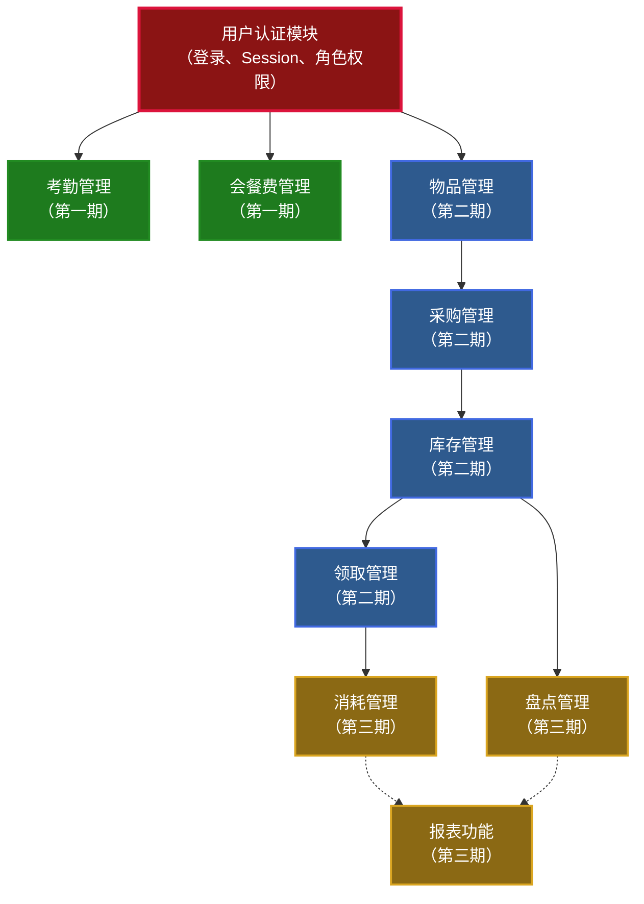
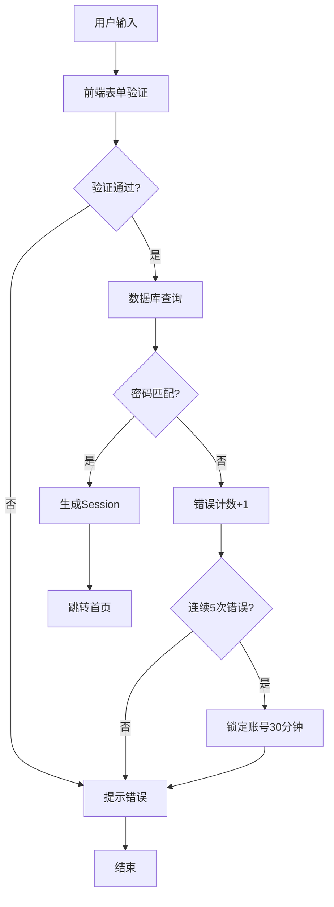
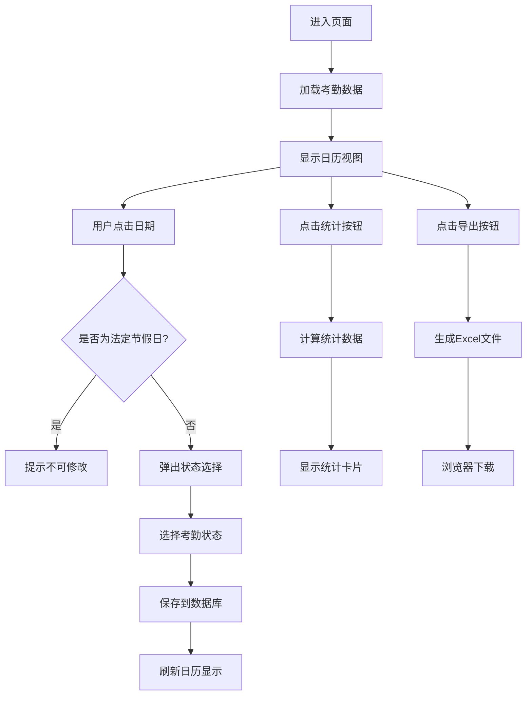
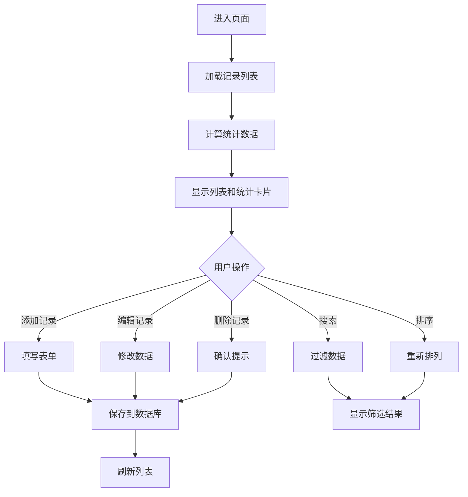
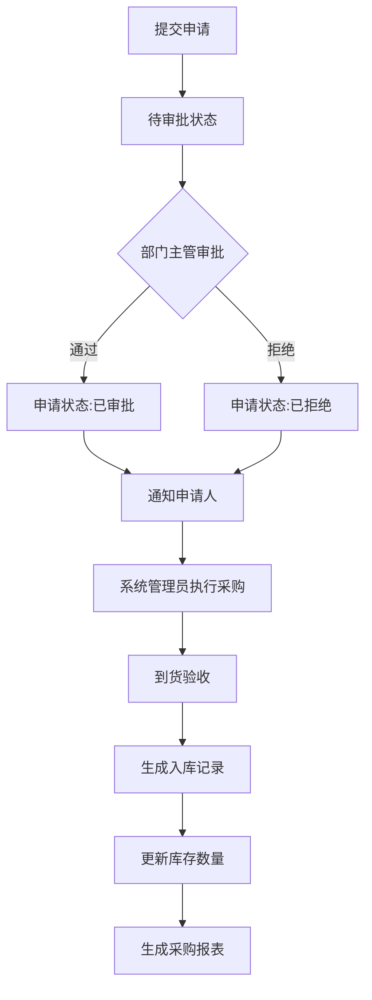
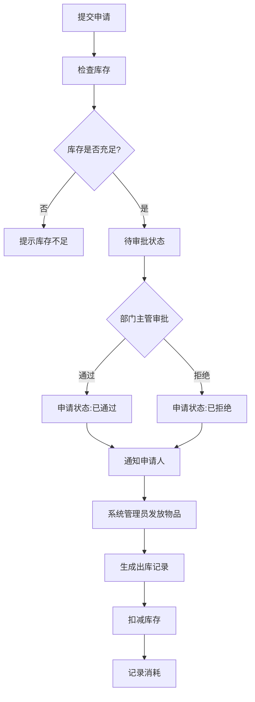
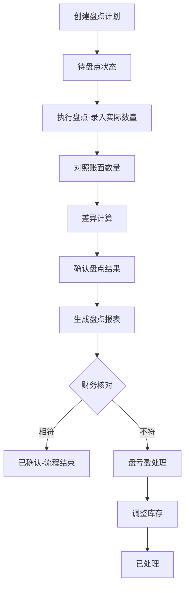
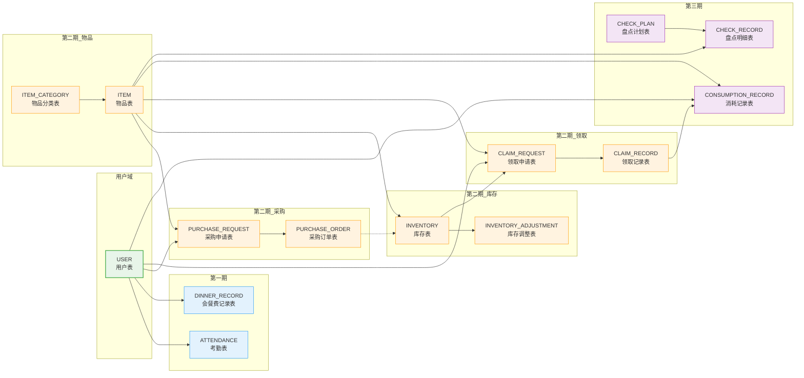
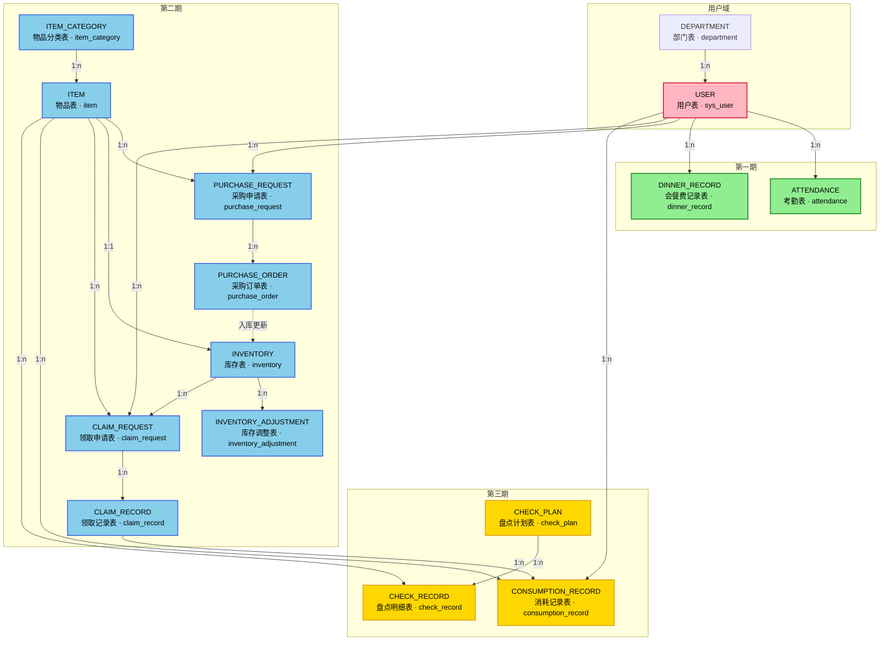
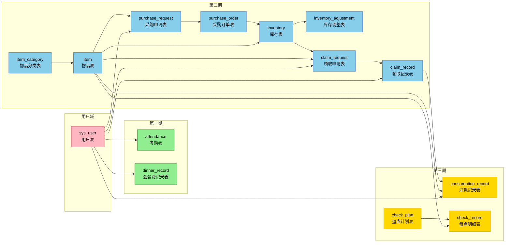

# 企业OA管理系统综合需求文档

## 文档信息

| 项目   | 内容                                  |
| ---- | ----------------------------------- |
| 系统名称 | 企业OA管理系统                            |
| 版本号  | V1.0                                |
| 创建日期 | 2026-04-11                          |
| 文档状态 | 初稿                                  |
| 基于文档 | 需求分析1.md（考勤和会餐费管理）、需求分析2.md（总务管理系统） |

***

## 1. 项目概述

### 1.1 系统背景

本系统是基于现代前端技术开发的OA管理平台，旨在为企业提供考勤管理、会餐费管理及总务管理的一站式解决方案。系统采用分期建设的模式：近期实现考勤管理和会餐费管理功能，中远期扩展至完整的总务管理系统。

**需求整合说明**：原需求分析1定位为OA平台的两个独立子模块，原需求分析2定位为独立的企业管理系统。本次整合将两者合并为一个统一的企业管理系统框架，考勤管理和会餐费管理作为第一期核心功能，总务管理系统其他功能作为未来扩展模块。

### 1.2 系统目标

- 实现企业日常考勤管理的数字化、规范化
- 实现会餐费管理的流程化、透明化
- 提高总务管理效率，减少人工操作失误
- 实现物品的精细化管理
- 提供准确的实时库存信息，支持最低库存预警
- 简化月度盘点流程，实现盘亏盘盈的有效管理
- 生成详细的管理报表，为决策提供数据支持

### 1.3 适用范围

适用于各类企事业单位的行政总务管理，可根据组织规模和需求进行灵活配置。

***

## 2. 用户角色定义

| 角色    | 职责               | 权限范围 |
| ----- | ---------------- | ---- |
| 系统管理员 | 负责系统日常操作和管理      | 全部功能 |
| 部门主管  | 负责审批采购申请、领取申请    | 审批功能 |
| 普通员工  | 提交采购申请、领取物品、考勤打卡 | 基础功能 |
| 财务人员  | 核对账目和盘点结果        | 财务相关 |

**新增说明**：本系统需支持多用户角色管理，原需求分析1未明确定义用户角色，本次整合参考需求分析2增加了完整的角色定义。

### 2.1 权限矩阵

| 功能模块      | 操作       | 系统管理员 | 部门主管 | 普通员工 | 财务人员 |
| --------- | -------- | :---: | :--: | :--: | :--: |
| **考勤管理**  | 查看自己的考勤  |   ✅   |   -  |   ✅  |   -  |
| <br />    | 修改自己的考勤  |   ✅   |   -  |   ✅  |   -  |
| <br />    | 删除自己的考勤  |   ✅   |   -  |   ✅  |   -  |
| <br />    | 查看所有员工考勤 |   ✅   |   -  |   -  |   -  |
| <br />    | 导出考勤报表   |   ✅   |   -  |   -  |   -  |
| **会餐费管理** | 查看会餐记录   |   ✅   |   -  |   ✅  |   -  |
| <br />    | 添加会餐记录   |   ✅   |   -  |   ✅  |   -  |
| <br />    | 编辑会餐记录   |   ✅   |   -  |   ✅  |   -  |
| <br />    | 删除会餐记录   |   ✅   |   -  |   -  |   -  |
| **采购管理**  | 提交采购申请   |   ✅   |   -  |   ✅  |   -  |
| <br />    | 审批采购申请   |   ✅   |   ✅  |   -  |   -  |
| <br />    | 执行采购     |   ✅   |   -  |   -  |   -  |
| <br />    | 查看采购记录   |   ✅   |   ✅  |   -  |   -  |
| **物品管理**  | 物品管理     |   ✅   |   -  |   -  |   -  |
| **库存管理**  | 查看库存     |   ✅   |   ✅  |   ✅  |   -  |
| <br />    | 库存调整     |   ✅   |   -  |   -  |   -  |
| **领取管理**  | 提交领取申请   |   ✅   |   -  |   ✅  |   -  |
| <br />    | 审批领取申请   |   ✅   |   ✅  |   -  |   -  |
| <br />    | 发放物品     |   ✅   |   -  |   -  |   -  |
| **盘点管理**  | 创建盘点计划   |   ✅   |   -  |   -  |   -  |
| <br />    | 执行盘点     |   ✅   |   -  |   -  |   -  |
| <br />    | 核对盘点结果   |   ✅   |   -  |   -  |   ✅  |
| **系统管理**  | 用户管理     |   ✅   |   -  |   -  |   -  |
| <br />    | 部门管理     |   ✅   |   -  |   -  |   -  |

### 2.2 初始用户

| 用户名     | 密码         | 角色    | 部门   |
| ------- | ---------- | ----- | ---- |
| admin   | admin123   | 系统管理员 | 行政部门 |
| manager | manager123 | 部门主管  | 行政部门 |
| user1   | user123    | 普通员工  | 行政部门 |
| finance | finance123 | 财务人员  | 财务部  |

***

## 3. 功能需求

### 3.1 考勤管理模块 【优先级：高 - 第一期】

| 需求ID     | 功能描述                                              | 需求来源  | 优先级 |
| -------- | ------------------------------------------------- | ----- | --- |
| ATT-001  | 月度考勤日历展示，支持按月份导航                                  | 需求分析1 | P0  |
| ATT-002  | 四种考勤状态标记：正常上班（实心圆）、全天休假（空心圆）、半天休假（半实心半空心圆）、加班（方框） | 需求分析1 | P0  |
| ATT-002a | 考勤状态录入/修改：点击具体日期，弹出考勤状态选择弹窗，保存考勤记录                | 需求分析1 | P0  |
| ATT-003  | 法定节假日默认标记（法定休假日标记为全天休假，法定工作日标记为全天上班）              | 需求分析1 | P0  |
| ATT-004  | 考勤统计功能，横向展开当月考勤明细                                 | 需求分析1 | P0  |
| ATT-005  | 考勤数据导出为Excel，使用符号标记考勤状态（正常上班●、全天休假○、半天休假◐、加班■）    | 需求分析1 | P0  |
| ATT-006  | 支持查看所有账号的考勤结果                                     | 需求分析1 | P1  |

### 3.2 会餐费管理模块 【优先级：高 - 第一期】

| 需求ID    | 功能描述                               | 需求来源  | 优先级 |
| ------- | ---------------------------------- | ----- | --- |
| DNM-001 | 会餐记录的添加、编辑、删除                      | 需求分析1 | P0  |
| DNM-002 | 会餐记录列表展示，支持按日期、部门、参与人数、金额、用途、负责人排序 | 需求分析1 | P0  |
| DNM-003 | 日期范围和金额范围搜索功能                      | 需求分析1 | P0  |
| DNM-004 | 会餐费用统计（总记录数、总金额、平均金额）              | 需求分析1 | P0  |
| DNM-005 | 发票上传功能（非必填项），支持图片预览                | 需求分析1 | P0  |
| DNM-006 | 数据持久化存储                            | 需求分析1 | P0  |

### 3.3 系统管理模块 【优先级：高 - 第一期】

| 需求ID    | 功能描述                          | 需求来源  | 优先级 |
| ------- | ----------------------------- | ----- | --- |
| SYS-001 | 用户管理：用户列表展示，支持查看、添加、编辑、删除用户信息 | 需求分析1 | P0  |
| SYS-002 | 密码修改：用户修改个人密码，首次登录强制修改默认密码    | 需求分析1 | P0  |
| SYS-003 | 部门管理：部门列表展示，支持添加、编辑、删除部门信息    | 需求分析1 | P0  |
| SYS-004 | 角色权限：基于RBAC的权限控制，不同角色访问不同功能菜单 | 需求分析1 | P0  |

### 3.3.1 节假日管理模块 【优先级：中 - 第一期】

#### 3.3.1.1 模块概述

节假日管理模块用于管理国家法定节假日和周末调休工作日，为考勤管理提供准确的节假日数据支持，实现节假日数据的动态配置，避免硬编码。

#### 3.3.1.2 设计原则

| 原则   | 说明                  |
| ---- | ------------------- |
| 动态配置 | 节假日数据存储在数据库，支持动态配置和调整 |
| 年度管理 | 按年度管理节假日数据，每年独立配置       |
| 自动判断 | 周末和节假日自动判断，无需手动标记       |
| 调休支持 | 支持配置周末调休工作日                 |

#### 3.3.1.3 功能需求

| 需求ID      | 功能描述                        | 优先级 |
| --------- | --------------------------- | --- |
| HOLI-001  | 年度节假日列表：按年度展示节假日配置信息     | P0  |
| HOLI-002  | 添加节假日：配置法定节假日（日期、名称、类型）  | P0  |
| HOLI-003  | 编辑节假日：修改节假日信息             | P0  |
| HOLI-004  | 删除节假日：删除节假日配置             | P0  |
| HOLI-005  | 周末调休配置：配置周末调休工作日         | P0  |
| HOLI-006  | 批量导入：支持从Excel批量导入节假日数据   | P1  |
| HOLI-007  | API接口：提供节假日查询接口，供其他模块调用 | P0  |
| HOLI-008  | 日期范围批量创建：支持日期范围选择，批量创建节假日（如春节长假） | P0  |

#### 3.3.1.4 页面原型说明

##### 3.3.1.4.1 节假日管理列表页

- **顶部**：年度选择器（默认当前年度）
- **表格**：
  - 日期（YYYY-MM-DD）
  - 节假日名称（元旦、春节、清明节等）
  - 类型（法定节假日/周末调休）
  - 操作（编辑、删除）
- **按钮**：新增节假日、批量导入

##### 3.3.1.4.2 新增/编辑节假日弹窗

**新增节假日模式：**
- 日期模式（单选：单个日期 / 日期范围）
- 年度（自动填充当前选择的年度）
- 日期模式=单个日期时：日期（日期选择器）
- 日期模式=日期范围时：日期范围选择器（开始日期 - 结束日期）
- 节假日名称（文本输入）
- 类型（单选：法定节假日/周末调休）
- 预览提示：显示将创建的节假日数量

**编辑节假日模式：**
- 年度（只读，不可修改）
- 日期（只读，不可修改）
- 节假日名称（文本输入）
- 类型（单选：法定节假日/周末调休）

#### 3.3.1.5 接口设计

| 接口路径                      | 方法     | 说明         |
| ------------------------- | ------ | ---------- |
| /api/holiday/list         | GET    | 获取节假日列表   |
| /api/holiday/year/{year}  | GET    | 获取指定年份节假日 |
| /api/holiday/create       | POST   | 创建节假日配置   |
| /api/holiday/batch        | POST   | 批量创建节假日配置 |
| /api/holiday/update/{id}  | PUT    | 更新节假日配置   |
| /api/holiday/delete/{id}  | DELETE | 删除节假日配置   |
| /api/holiday/year/{year}  | DELETE | 删除指定年份节假日 |
| /api/holiday/import       | POST   | 批量导入节假日   |
| /api/holiday/check        | GET    | 检查指定日期是否为节假日 |

#### 3.3.1.6 数据库设计

##### 3.3.1.6.1 节假日配置表（holiday）

| 字段名      | 类型       | 说明     | 约束        |
| -------- | -------- | ------ | --------- |
| id       | BIGINT   | 主键     | PK        |
| year     | INT      | 年份     | NOT NULL  |
| month    | INT      | 月份     | NOT NULL  |
| day      | INT      | 日期     | NOT NULL  |
| name     | VARCHAR  | 节假日名称 | NOT NULL  |
| type     | VARCHAR  | 类型     | 法定节假日/调休 |
| created_at | DATETIME | 创建时间   | <br />    |
| updated_at | DATETIME | 更新时间   | <br />    |

**联合唯一约束**：(year, month, day)

#### 3.3.1.7 与其他模块的关系

| 上游模块   | 下游模块  | 关系说明              |
| ------ | ----- | ----------------- |
| 节假日管理 | 考勤管理 | 考勤模块调用节假日接口判断是否为休息日 |

### 3.4 数据字典管理模块 【优先级：中 - 第一期】

#### 3.4.1 模块概述

数据字典管理模块用于集中管理系统中的各种代码类数据，实现代码标准化管理，减少硬编码，提高系统的可维护性和扩展性。

#### 3.4.2 设计原则

| 原则   | 说明                  |
| ---- | ------------------- |
| 标准化  | 统一代码格式和命名规范，便于识别和维护 |
| 层次化  | 按业务领域分类，形成树形结构，便于查找 |
| 可扩展  | 支持新增、修改、禁用，不影响现有业务  |
| 可追溯  | 记录创建时间、修改历史，便于审计和追踪 |
| 关联业务 | 代码与具体业务模块关联，影响范围明确  |

#### 3.4.3 数据字典分类

##### 3.4.3.1 考勤状态（DICT\_ATT）

| 代码     | 名称   | 说明   | 状态 | 图标 |
| ------ | ---- | ---- | -- | -- |
| ATT001 | 正常上班 | 正常出勤 | 启用 | ●  |
| ATT002 | 迟到   | 上班迟到 | 启用 | ⏰  |
| ATT003 | 早退   | 上班早退 | 启用 | ⏱  |
| ATT004 | 全天休假 | 全天请假 | 启用 | ○  |
| ATT005 | 半天休假 | 半天请假 | 启用 | ◐  |
| ATT006 | 旷工   | 无故缺勤 | 启用 | ✗  |
| ATT007 | 出差   | 外出办公 | 启用 | ✈  |
| ATT008 | 加班   | 延长工时 | 启用 | ■  |

##### 3.4.3.2 用户角色（DICT\_ROLE）

| 代码          | 名称    | 说明        | 状态 | 权限级别 |
| ----------- | ----- | --------- | -- | ---- |
| ROLE\_ADMIN | 系统管理员 | 系统全部功能管理  | 启用 | 1    |
| ROLE\_DEPT  | 部门主管  | 部门内部管理、审批 | 启用 | 2    |
| ROLE\_USER  | 普通员工  | 基础功能操作    | 启用 | 3    |
| ROLE\_FIN   | 财务人员  | 财务相关功能    | 启用 | 2    |

##### 3.4.3.3 物品分类（DICT\_ITEM\_CATEGORY）

| 代码           | 名称   | 说明       | 状态 | 备注    |
| ------------ | ---- | -------- | -- | ----- |
| CAT\_OFFICE  | 办公用品 | 笔、纸、文件夹等 | 启用 | 第二期使用 |
| CAT\_CONSUME | 消耗品  | 打印纸、墨盒等  | 启用 | 第二期使用 |
| CAT\_ASSET   | 设备资产 | 电脑、打印机等  | 启用 | 第二期使用 |

##### 3.4.3.4 审批状态（DICT\_APPROVAL）

| 代码        | 名称  | 说明    | 状态 | 颜色标识 |
| --------- | --- | ----- | -- | ---- |
| APP\_PEND | 待审批 | 等待审批  | 启用 | 黄色   |
| APP\_PASS | 已通过 | 审批通过  | 启用 | 绿色   |
| APP\_REJ  | 已拒绝 | 审批拒绝  | 启用 | 红色   |
| APP\_CANC | 已取消 | 申请人取消 | 启用 | 灰色   |

##### 3.4.3.5 库存调整类型（DICT\_INV\_ADJUST）

| 代码         | 名称 | 说明     | 状态 | 影响库存 |
| ---------- | -- | ------ | -- | ---- |
| INV\_ADD   | 盘盈 | 实际多于账面 | 启用 | +    |
| INV\_SUB   | 盘亏 | 实际少于账面 | 启用 | -    |
| INV\_LOSS  | 报损 | 损坏报废   | 启用 | -    |
| INV\_GIFT  | 赠送 | 赠送物品   | 启用 | -    |
| INV\_TRANS | 调拨 | 部门间调拨  | 启用 | ±    |

#### 3.4.4 功能需求

| 需求ID     | 功能描述                        | 优先级 |
| -------- | --------------------------- | --- |
| DICT-001 | 数据字典分类管理：支持查看、添加、编辑、删除字典分类  | P1  |
| DICT-002 | 数据字典项管理：支持查看、添加、编辑、删除、禁用字典项 | P0  |
| DICT-003 | 字典项排序：支持拖拽排序，调整显示顺序         | P2  |
| DICT-004 | 字典项搜索：支持按代码、名称快速搜索          | P1  |
| DICT-005 | 字典导出：支持导出字典数据为Excel         | P2  |
| DICT-006 | 字典导入：支持从Excel批量导入字典项        | P2  |
| DICT-007 | 字典缓存：字典数据缓存，减少数据库查询         | P1  |
| DICT-008 | 字典引用检查：删除前检查是否被业务引用         | P1  |

#### 3.4.5 页面原型说明

##### 3.4.5.1 数据字典列表页

- **左侧**：字典分类树形菜单（层级展示）
- **右侧**：选中分类的字典项列表
  - 表头：代码、名称、说明、状态、操作
  - 支持新增、编辑、删除、禁用、排序
  - 顶部：搜索框、导入/导出按钮

##### 3.4.5.2 新增/编辑字典项弹窗

- 字典分类（下拉选择，只读）
- 字典代码（文本输入，唯一性校验）
- 字典名称（文本输入，必填）
- 字典说明（文本输入，可选）
- 排序号（数字输入，默认当前最大+1）
- 状态（单选：启用/禁用）

#### 3.4.6 接口设计

##### 3.4.6.1 分类管理接口

| 接口路径                      | 方法     | 说明     |
| ------------------------- | ------ | ------ |
| /api/dict/category/list   | GET    | 获取分类列表 |
| /api/dict/category/{id}   | GET    | 获取分类详情 |
| /api/dict/category/create | POST   | 创建分类   |
| /api/dict/category/update | PUT    | 更新分类   |
| /api/dict/category/delete | DELETE | 删除分类   |

##### 3.4.6.2 字典项管理接口

| 接口路径                   | 方法     | 说明      |
| ---------------------- | ------ | ------- |
| /api/dict/item/list    | GET    | 获取字典项列表 |
| /api/dict/item/{id}    | GET    | 获取字典项详情 |
| /api/dict/item/create  | POST   | 创建字典项   |
| /api/dict/item/update  | PUT    | 更新字典项   |
| /api/dict/item/delete  | DELETE | 删除字典项   |
| /api/dict/item/enable  | PUT    | 启用字典项   |
| /api/dict/item/disable | PUT    | 禁用字典项   |
| /api/dict/item/sort    | PUT    | 排序字典项   |
| /api/dict/item/export  | GET    | 导出字典项   |
| /api/dict/item/import  | POST   | 导入字典项   |

#### 3.4.7 数据库设计

##### 3.4.7.1 字典分类表（dict\_category）

| 字段名         | 类型       | 说明   | 约束        |
| ----------- | -------- | ---- | --------- |
| id          | BIGINT   | 主键   | PK        |
| code        | VARCHAR  | 分类代码 | UNIQUE    |
| name        | VARCHAR  | 分类名称 | NOT NULL  |
| parent\_id  | BIGINT   | 父级ID | FK        |
| sort\_order | INT      | 排序号  | DEFAULT 0 |
| status      | TINYINT  | 状态   | DEFAULT 1 |
| created\_at | DATETIME | 创建时间 | <br />    |
| updated\_at | DATETIME | 更新时间 | <br />    |

##### 3.4.7.2 字典项表（dict\_item）

| 字段名          | 类型       | 说明   | 约束        |
| ------------ | -------- | ---- | --------- |
| id           | BIGINT   | 主键   | PK        |
| category\_id | BIGINT   | 分类ID | FK        |
| code         | VARCHAR  | 字典代码 | NOT NULL  |
| name         | VARCHAR  | 字典名称 | NOT NULL  |
| description  | VARCHAR  | 说明   | <br />    |
| sort\_order  | INT      | 排序号  | DEFAULT 0 |
| status       | TINYINT  | 状态   | DEFAULT 1 |
| extra        | JSON     | 扩展字段 | <br />    |
| created\_at  | DATETIME | 创建时间 | <br />    |
| updated\_at  | DATETIME | 更新时间 | <br />    |

**联合唯一约束**：(category\_id, code)

#### 3.4.8 技术实现要点

| 要点     | 说明                                  |
| ------ | ----------------------------------- |
| 缓存策略   | 使用Redis缓存字典数据，设置1小时过期，修改时主动刷新缓存     |
| 唯一性校验  | 分类代码、字典代码全局唯一，保存前进行唯一性校验            |
| 软删除    | 字典项采用软删除方式，禁用而非删除，保留历史数据            |
| 引用检查   | 删除字典项前，检查是否被业务表引用，如被引用则阻止删除         |
| 批量操作   | 导入导出使用EasyExcel，支持大数量导入             |
| 前端组件封装 | 封装通用字典选择组件，支持下拉、Radio、Checkbox等多种形式 |

#### 3.4.9 与其他模块的关系

| 上游模块 | 下游模块 | 关系说明         |
| ---- | ---- | ------------ |
| 数据字典 | 考勤管理 | 考勤状态使用数据字典   |
| 数据字典 | 用户管理 | 用户角色使用数据字典   |
| 数据字典 | 物品管理 | 物品分类使用数据字典   |
| 数据字典 | 审批流程 | 审批状态使用数据字典   |
| 数据字典 | 库存管理 | 库存调整类型使用数据字典 |

#### 3.4.10 预期效果

| 效果指标  | 说明                 |
| ----- | ------------------ |
| 代码标准化 | 消除硬编码，统一使用字典代码     |
| 维护简化  | 修改代码只需改字典表，无需改代码   |
| 扩展便捷  | 新增代码类型只需添加字典项      |
| 查询优化  | 字典数据缓存，接口响应时间<50ms |
| 管理可视化 | 提供统一管理界面，方便维护和审计   |

### 3.5 权限管理模块 【优先级：高 - 第一期】

#### 3.5.1 模块概述

权限管理模块采用RBAC（基于角色的访问控制）模型，通过角色关联权限，用户拥有角色间接获得权限，实现灵活的权限控制。

#### 3.5.2 设计原则

| 原则   | 说明                  |
| ---- | ------------------- |
| 最小权限 | 用户只获得完成工作所需的最小权限    |
| 角色分组 | 将权限打包到角色，简化权限分配工作   |
| 继承简化 | 支持角色继承，高级角色继承低级角色权限 |
| 职责分离 | 关键操作需要多个角色授权，防止权限滥用 |
| 审计追溯 | 记录权限变更历史，便于安全审计     |

#### 3.5.3 权限定义

##### 3.5.3.1 系统权限列表

| 权限代码            | 权限名称    | 说明           |
| --------------- | ------- | ------------ |
| ATT\_VIEW\_OWN  | 查看自己的考勤 | 普通员工查看个人考勤记录 |
| ATT\_EDIT\_OWN  | 修改自己的考勤 | 普通员工修改个人考勤记录 |
| ATT\_DELETE\_OWN | 删除自己的考勤 | 普通员工删除个人考勤记录 |
| ATT\_VIEW\_ALL  | 查看所有考勤  | 管理员查看所有员工考勤  |
| ATT\_EXPORT     | 导出考勤报表  | 管理员导出考勤数据    |
| DNM\_VIEW       | 查看会餐记录  | 查看会餐费用记录     |
| DNM\_ADD        | 添加会餐记录  | 新增会餐费用记录     |
| DNM\_EDIT       | 编辑会餐记录  | 修改会餐费用记录     |
| DNM\_DELETE     | 删除会餐记录  | 删除会餐费用记录     |
| PUR\_SUBMIT     | 提交采购申请  | 员工提交采购申请     |
| PUR\_APPROVE    | 审批采购申请  | 部门主管审批采购申请   |
| PUR\_EXECUTE    | 执行采购    | 管理员执行采购      |
| PUR\_VIEW       | 查看采购记录  | 查看采购历史记录     |
| ITEM\_MANAGE    | 物品管理    | 物品的增删改查      |
| INV\_VIEW       | 查看库存    | 查看库存数据       |
| INV\_ADJUST     | 库存调整    | 调整库存数量       |
| CLAIM\_SUBMIT   | 提交领取申请  | 员工提交物品领取申请   |
| CLAIM\_APPROVE  | 审批领取申请  | 部门主管审批领取申请   |
| CLAIM\_ISSUE    | 发放物品    | 管理员发放物品      |
| CHECK\_CREATE   | 创建盘点计划  | 创建月度盘点计划     |
| CHECK\_EXECUTE  | 执行盘点    | 执行库存盘点       |
| CHECK\_AUDIT    | 核对盘点结果  | 财务人员核对盘点结果   |
| SYS\_USER\_VIEW | 查看用户    | 查看用户列表       |
| SYS\_USER\_EDIT | 用户管理    | 增删改用户        |
| SYS\_DEPT\_VIEW | 查看部门    | 查看部门列表       |
| SYS\_DEPT\_EDIT | 部门管理    | 增删改部门        |
| SYS\_ROLE\_VIEW | 查看角色    | 查看角色列表       |
| SYS\_ROLE\_EDIT | 角色管理    | 增删改角色，分配权限   |
| SYS\_DICT\_VIEW | 查看数据字典  | 查看字典分类和字典项   |
| SYS\_DICT\_EDIT | 数据字典管理  | 增删改字典分类和字典项  |

##### 3.5.3.2 系统角色权限配置

| 角色    | 考勤权限      | 会餐权限     | 采购权限 | 库存权限 | 领取权限 | 盘点权限 | 系统权限 |
| ----- | --------- | -------- | ---- | ---- | ---- | ---- | ---- |
| 系统管理员 | 全部        | 全部       | 全部   | 全部   | 全部   | 全部   | 全部   |
| 部门主管  | 查看自己      | -        | 审批   | 查看   | 审批   | -    | -    |
| 普通员工  | 查看/修改/删除自己 | 添加/查看/编辑 | 提交   | 查看   | 提交   | -    | -    |
| 财务人员  | -         | -        | -    | -    | -    | 核对   | -    |

#### 3.5.4 功能需求

| 需求ID     | 功能描述                 | 优先级 |
| -------- | -------------------- | --- |
| AUTH-001 | 登录认证：用户名密码验证，JWT令牌生成 | P0  |
| AUTH-002 | 登出功能：清除登录状态          | P0  |
| AUTH-003 | 密码修改：用户修改个人密码        | P0  |
| AUTH-004 | 首次登录强制修改密码           | P1  |
| AUTH-005 | 会话超时自动登出             | P1  |
| ROLE-001 | 角色列表：展示所有角色，支持按名称搜索  | P0  |
| ROLE-002 | 角色新增：创建新角色，指定角色名称和描述 | P0  |
| ROLE-003 | 角色编辑：修改角色名称和描述       | P0  |
| ROLE-004 | 角色删除：删除角色，解除与用户的关联   | P0  |
| ROLE-005 | 权限分配：为角色分配/取消权限      | P0  |
| ROLE-006 | 角色继承：设置角色继承关系        | P2  |
| USER-001 | 用户角色分配：为用户分配/变更角色    | P0  |
| USER-002 | 用户状态管理：启用/禁用用户       | P0  |
| PERM-001 | 权限验证：后端接口校验用户权限      | P0  |
| PERM-002 | 菜单过滤：根据用户权限动态显示菜单    | P0  |
| PERM-003 | 按钮控制：根据用户权限显示/隐藏操作按钮 | P0  |
| PERM-004 | 操作日志：记录用户权限变更和敏感操作   | P1  |

#### 3.5.5 页面原型说明

##### 3.5.5.1 角色管理页面

- **角色列表**：展示所有角色，包括角色名称、描述、权限数量、用户数量
- **操作按钮**：新增角色、编辑、删除、分配权限
- **权限分配弹窗**：左侧为系统权限树，右侧为已选权限列表

##### 3.5.5.2 用户角色分配页面

- **用户列表**：展示所有用户，包括用户名、姓名、当前角色
- **角色分配**：选择用户，点击"分配角色"，弹出角色选择框

##### 3.5.5.3 个人设置页面

- **密码修改**：输入原密码、新密码、确认密码
- **个人信息**：查看当前用户名、角色、权限列表

#### 3.5.6 接口设计

##### 3.5.6.1 认证接口

| 接口路径               | 方法   | 说明       |
| ------------------ | ---- | -------- |
| /api/auth/login    | POST | 用户登录     |
| /api/auth/logout   | POST | 用户登出     |
| /api/auth/password | PUT  | 修改密码     |
| /api/auth/info     | GET  | 获取当前用户信息 |

##### 3.5.6.2 角色管理接口

| 接口路径                       | 方法     | 说明     |
| -------------------------- | ------ | ------ |
| /api/role/list             | GET    | 获取角色列表 |
| /api/role/{id}             | GET    | 获取角色详情 |
| /api/role/create           | POST   | 创建角色   |
| /api/role/update           | PUT    | 更新角色   |
| /api/role/delete/{id}      | DELETE | 删除角色   |
| /api/role/{id}/permissions | GET    | 获取角色权限 |
| /api/role/{id}/permissions | PUT    | 分配角色权限 |

##### 3.5.6.3 权限验证接口

| 接口路径                      | 方法  | 说明       |
| ------------------------- | --- | -------- |
| /api/permission/list      | GET | 获取所有权限定义 |
| /api/permission/user/{id} | GET | 获取用户权限列表 |

#### 3.5.7 数据库设计

##### 3.5.7.1 权限表（sys\_permission）

| 字段名         | 类型       | 说明   | 约束        |
| ----------- | -------- | ---- | --------- |
| id          | BIGINT   | 主键   | PK        |
| code        | VARCHAR  | 权限代码 | UNIQUE    |
| name        | VARCHAR  | 权限名称 | NOT NULL  |
| category    | VARCHAR  | 权限分类 | <br />    |
| description | VARCHAR  | 权限描述 | <br />    |
| sort\_order | INT      | 排序号  | DEFAULT 0 |
| status      | TINYINT  | 状态   | DEFAULT 1 |
| created\_at | DATETIME | 创建时间 | <br />    |
| updated\_at | DATETIME | 更新时间 | <br />    |

##### 3.5.7.2 角色表（sys\_role）

| 字段名         | 类型       | 说明    | 约束        |
| ----------- | -------- | ----- | --------- |
| id          | BIGINT   | 主键    | PK        |
| code        | VARCHAR  | 角色代码  | UNIQUE    |
| name        | VARCHAR  | 角色名称  | NOT NULL  |
| description | VARCHAR  | 角色描述  | <br />    |
| parent\_id  | BIGINT   | 父角色ID | FK        |
| sort\_order | INT      | 排序号   | DEFAULT 0 |
| status      | TINYINT  | 状态    | DEFAULT 1 |
| created\_at | DATETIME | 创建时间  | <br />    |
| updated\_at | DATETIME | 更新时间  | <br />    |

##### 3.5.7.3 角色权限关联表（sys\_role\_permission）

| 字段名            | 类型       | 说明   | 约束     |
| -------------- | -------- | ---- | ------ |
| id             | BIGINT   | 主键   | PK     |
| role\_id       | BIGINT   | 角色ID | FK     |
| permission\_id | BIGINT   | 权限ID | FK     |
| created\_at    | DATETIME | 创建时间 | <br /> |

**联合唯一约束**：(role\_id, permission\_id)

##### 3.5.7.4 用户角色关联表（sys\_user\_role）

| 字段名         | 类型       | 说明   | 约束     |
| ----------- | -------- | ---- | ------ |
| id          | BIGINT   | 主键   | PK     |
| user\_id    | BIGINT   | 用户ID | FK     |
| role\_id    | BIGINT   | 角色ID | FK     |
| created\_at | DATETIME | 创建时间 | <br /> |

**联合唯一约束**：(user\_id, role\_id)

##### 3.5.7.5 操作日志表（sys\_operation\_log）

| 字段名          | 类型       | 说明   | 约束     |
| ------------ | -------- | ---- | ------ |
| id           | BIGINT   | 主键   | PK     |
| user\_id     | BIGINT   | 用户ID | FK     |
| action       | VARCHAR  | 操作类型 | <br /> |
| resource     | VARCHAR  | 资源类型 | <br /> |
| resource\_id | BIGINT   | 资源ID | <br /> |
| detail       | TEXT     | 操作详情 | <br /> |
| ip\_address  | VARCHAR  | IP地址 | <br /> |
| created\_at  | DATETIME | 操作时间 | <br /> |

#### 3.5.8 与其他模块的关系

| 上游模块 | 下游模块   | 关系说明           |
| ---- | ------ | -------------- |
| 权限管理 | 所有业务模块 | 所有业务接口都需要权限验证  |
| 权限管理 | 用户管理   | 用户角色分配依赖用户管理   |
| 权限管理 | 菜单系统   | 菜单显示根据用户权限动态过滤 |

#### 3.5.9 技术实现要点

| 要点     | 说明                               |
| ------ | -------------------------------- |
| JWT认证  | 使用JWT令牌进行无状态认证，支持过期时间和刷新         |
| 权限注解   | 后端使用@RequiresPermissions注解进行权限校验 |
| 菜单动态加载 | 前端根据用户权限动态生成菜单，过滤无权限菜单           |
| 按钮级权限  | 前端使用v-if或自定义指令控制按钮显示             |
| 缓存策略   | 用户权限信息缓存到Redis，减少数据库查询           |
| 审计日志   | 记录所有权限变更和敏感操作，便于安全追溯             |

#### 3.5.10 实现方案设计

##### 3.5.10.1 现状分析

| 已有功能    | 说明                          |
| ------- | --------------------------- |
| ✅ JWT认证 | JwtAuthenticationFilter 已实现 |
| ✅ 用户实体  | User 表已存在，role字段存储角色名       |
| ✅ 登录接口  | AuthController 登录/登出接口      |
| ❌ 权限控制  | 无权限、角色、菜单权限控制               |

##### 3.5.10.2 方案选择

**选择：轻量级RBAC方案（方案A）**

- 权限数据存数据库，登录时加载到 JWT
- 优点：灵活，运行时可修改
- 结合本地缓存，权限变更时清除缓存

##### 3.5.10.3 分阶段实施计划

**阶段1：数据库表设计**

| 表名                    | 说明          | 优先级 |
| --------------------- | ----------- | --- |
| sys\_permission       | 权限表，29条权限数据 | P0  |
| sys\_role             | 角色表，4个预置角色  | P0  |
| sys\_role\_permission | 角色权限关联表     | P0  |
| sys\_user\_role       | 用户角色关联表     | P0  |
| sys\_operation\_log   | 操作日志表       | P1  |

**阶段2：后端权限框架**

| 组件         | 说明                             | 优先级 |
| ---------- | ------------------------------ | --- |
| 实体类        | Permission, Role               | P0  |
| Mapper     | PermissionMapper, RoleMapper   | P0  |
| Service    | PermissionService, RoleService | P0  |
| Controller | RoleController（角色CRUD）         | P0  |
| 权限注解       | @RequirePermission("code")     | P0  |
| 拦截器        | 权限校验过滤器                        | P0  |
| 登录增强       | 查询用户角色和权限，存入JWT                | P0  |

**阶段3：前端权限控制**

| 组件     | 说明           | 优先级 |
| ------ | ------------ | --- |
| 权限指令   | v-permission | P0  |
| 角色管理页面 | 角色列表、权限分配    | P0  |
| 用户角色管理 | 分配/变更角色      | P0  |
| 菜单权限   | 根据用户角色动态显示   | P1  |
| 按钮权限   | 权限指令控制显示/隐藏  | P1  |

##### 3.5.10.4 核心设计

**1. 权限存储方案**

```
方案A：权限数据存数据库
- 登录时：从数据库加载用户角色和权限
- 存入JWT：包含 userId, role, permissions[]
- 本地缓存：用户权限信息缓存到Redis
- 变更时：权限变更后清除缓存，下次登录重新加载
```

**2. 权限校验流程**

```
请求 → JwtFilter(验证token) → 获取userId → 查询用户角色+权限 → 检查是否有权限 → 通过/拒绝
```

**3. 菜单权限方案**

```
登录时返回：{ userId, role, permissions: ["ATT_VIEW_OWN", ...], menus: [...] }
前端：根据 permissions 过滤菜单和按钮
```

##### 3.5.10.5 实施优先级

| 优先级 | 功能         | 说明     |
| --- | ---------- | ------ |
| P0  | 角色管理（CRUD） | 基础功能   |
| P0  | 权限分配       | 角色绑定权限 |
| P0  | 用户角色分配     | 用户绑定角色 |
| P0  | 后端权限拦截     | 接口权限校验 |
| P1  | 前端菜单权限     | 菜单过滤   |
| P1  | 前端按钮权限     | 按钮显示控制 |
| P2  | 操作日志       | 审计追溯   |

##### 3.5.10.6 关键设计决策

| 问题      | 决策               | 说明                      |
| ------- | ---------------- | ----------------------- |
| User表修改 | 保留role字段 + 新增关联表 | role用于显示，关联表支持多角色       |
| 权限粒度    | 粗粒度优先            | 第一期实现功能级权限，后续细化         |
| 角色继承    | 第一期暂不实现          | 简化复杂度                   |
| 前端控制方式  | 后端返回菜单           | 后端返回用户有权限的菜单，前端只显示返回的菜单 |

##### 3.5.10.7 数据初始化

**预置角色（4个）**

| 角色代码        | 角色名称  | 说明     |
| ----------- | ----- | ------ |
| ROLE\_ADMIN | 系统管理员 | 全部权限   |
| ROLE\_DEPT  | 部门主管  | 审批相关权限 |
| ROLE\_USER  | 普通员工  | 基础功能权限 |
| ROLE\_FIN   | 财务人员  | 财务相关权限 |

**预置权限（29个）**

| 分类    | 权限代码            | 权限名称    |
| ----- | --------------- | ------- |
| 考勤    | ATT\_VIEW\_OWN  | 查看自己的考勤 |
| 考勤    | ATT\_EDIT\_OWN  | 修改自己的考勤 |
| 考勤    | ATT\_VIEW\_ALL  | 查看所有考勤  |
| 考勤    | ATT\_EXPORT     | 导出考勤报表  |
| 会餐    | DNM\_VIEW       | 查看会餐记录  |
| 会餐    | DNM\_ADD        | 添加会餐记录  |
| 会餐    | DNM\_EDIT       | 编辑会餐记录  |
| 会餐    | DNM\_DELETE     | 删除会餐记录  |
| 采购    | PUR\_SUBMIT     | 提交采购申请  |
| 采购    | PUR\_APPROVE    | 审批采购申请  |
| 采购    | PUR\_EXECUTE    | 执行采购    |
| 采购    | PUR\_VIEW       | 查看采购记录  |
| 物品    | ITEM\_MANAGE    | 物品管理    |
| 库存    | INV\_VIEW       | 查看库存    |
| 库存    | INV\_ADJUST     | 库存调整    |
| 领取    | CLAIM\_SUBMIT   | 提交领取申请  |
| 领取    | CLAIM\_APPROVE  | 审批领取申请  |
| 领取    | CLAIM\_ISSUE    | 发放物品    |
| 盘点    | CHECK\_CREATE   | 创建盘点计划  |
| 盘点    | CHECK\_EXECUTE  | 执行盘点    |
| 盘点    | CHECK\_AUDIT    | 核对盘点结果  |
| 系统-用户 | SYS\_USER\_VIEW | 查看用户    |
| 系统-用户 | SYS\_USER\_EDIT | 用户管理    |
| 系统-部门 | SYS\_DEPT\_VIEW | 查看部门    |
| 系统-部门 | SYS\_DEPT\_EDIT | 部门管理    |
| 系统-角色 | SYS\_ROLE\_VIEW | 查看角色    |
| 系统-角色 | SYS\_ROLE\_EDIT | 角色管理    |
| 系统-字典 | SYS\_DICT\_VIEW | 查看数据字典  |
| 系统-字典 | SYS\_DICT\_EDIT | 数据字典管理  |

### 3.6 物品管理模块 【优先级：中 - 第二期】

| 需求ID    | 功能描述                                     | 需求来源  | 优先级 |
| ------- | ---------------------------------------- | ----- | --- |
| ITM-001 | 物品分类管理：支持办公用品、消耗品、设备资产等分类                | 需求分析2 | P2  |
| ITM-002 | 物品信息维护：添加、编辑、删除物品信息，包括名称、规格、单位、分类、最低库存值等 | 需求分析2 | P2  |
| ITM-003 | 物品查询：支持按名称、分类、规格等条件查询                    | 需求分析2 | P2  |

### 3.7 采购管理模块 【优先级：中 - 第二期】

| 需求ID    | 功能描述                          | 需求来源  | 优先级 |
| ------- | ----------------------------- | ----- | --- |
| PUR-001 | 采购申请：普通员工提交采购申请，包括物品名称、数量、用途等 | 需求分析2 | P2  |
| PUR-002 | 采购审批：部门主管审批采购申请               | 需求分析2 | P2  |
| PUR-003 | 采购执行：总务管理员根据审批结果执行采购          | 需求分析2 | P2  |
| PUR-004 | 采购入库：采购物品入库，更新库存              | 需求分析2 | P2  |
| PUR-005 | 采购记录管理：查看历史采购记录               | 需求分析2 | P2  |

### 3.8 功能模块依赖关系

#### 3.8.1 依赖关系概述

各功能模块之间存在一定的依赖关系，按照开发优先级可分为以下两类：

| 类别       | 说明                    |
| -------- | --------------------- |
| **独立模块** | 可独立开发、测试和上线，不依赖其他功能模块 |
| **依赖模块** | 需要先完成其依赖的前置模块后才能正常运作  |

#### 3.8.2 模块依赖关系表

| 上游模块 | 下游模块 | 依赖说明                  |
| :--: | :--: | :-------------------- |
| 用户认证 | 所有模块 | 所有模块依赖用户角色和权限数据进行访问控制 |
| 物品管理 | 采购管理 | 采购前需先建立物品基础数据（名称、规格等） |
| 采购管理 | 库存管理 | 采购入库后更新库存数量           |
| 库存管理 | 领取管理 | 员工领取时需检查库存是否充足        |
| 库存管理 | 消耗管理 | 根据领取记录自动统计物品消耗情况      |
| 采购管理 | 领取管理 | 采购入库 → 员工领取 → 系统记录消耗  |
| 库存管理 | 盘点管理 | 盘点时对比账面库存与实际库存        |

#### 3.8.3 开发顺序建议

```
第一期（可并行开发）
├── 用户认证模块（基础支撑）
├── 考勤管理模块
└── 会餐费管理模块

第二期
├── 物品管理模块
├── 采购管理模块（依赖物品管理）
├── 库存管理模块（依赖采购管理）
└── 领取管理模块（依赖库存管理）

第三期
├── 消耗管理模块（依赖领取管理）
├── 盘点管理模块（依赖库存管理）
└── 报表功能模块（依赖各模块数据）
```

#### 3.8.4 依赖关系图



#### 3.8.5 结论

- **第一期**：考勤管理、会餐费管理、系统管理、数据字典管理均为独立模块，可并行开发、独立上线
- **第二/三期**：模块间存在线性依赖链，需按顺序开发

### 3.9 库存管理模块 【优先级：中 - 第二期】

| 需求ID    | 功能描述                        | 需求来源  | 优先级 |
| ------- | --------------------------- | ----- | --- |
| INV-001 | 实时库存查询：查看当前库存状态             | 需求分析2 | P2  |
| INV-002 | 库存预警：当物品库存达到最低值时，系统自动发送邮件提醒 | 需求分析2 | P2  |
| INV-003 | 库存调整：支持因特殊原因进行的库存调整         | 需求分析2 | P2  |
| INV-004 | 库存报表：生成库存状态报表               | 需求分析2 | P2  |

### 3.10 消耗管理模块 【优先级：低 - 第二期】

| 需求ID    | 功能描述                 | 需求来源  | 优先级 |
| ------- | -------------------- | ----- | --- |
| CNS-001 | 物品领取：员工领取物品，系统记录领取信息 | 需求分析2 | P3  |
| CNS-002 | 消耗记录：自动记录物品消耗情况      | 需求分析2 | P3  |
| CNS-003 | 消耗报表：生成物品消耗报表        | 需求分析2 | P3  |

### 3.11 盘点管理模块 【优先级：低 - 第二期】

| 需求ID   | 功能描述                     | 需求来源  | 优先级 |
| ------ | ------------------------ | ----- | --- |
| CK-001 | 盘点计划：制定月度盘点计划            | 需求分析2 | P3  |
| CK-002 | 盘点执行：总务管理员进行实际盘点，记录实际数量  | 需求分析2 | P3  |
| CK-003 | 盘亏盘盈处理：系统自动计算盘亏盘盈，生成盘点报表 | 需求分析2 | P3  |
| CK-004 | 盘点历史：查看历史盘点记录            | 需求分析2 | P3  |

***

## 4. 非功能需求

### 4.1 性能需求

| 需求项    | 指标要求           | 需求来源  |
| ------ | -------------- | ----- |
| 页面加载时间 | 不超过2秒          | 需求分析2 |
| 数据处理能力 | 支持并发100人同时操作   | 需求分析2 |
| 报表生成时间 | 复杂报表生成时间不超过10秒 | 需求分析2 |

### 4.2 安全性需求

| 需求项  | 指标要求                   | 需求来源  |
| ---- | ---------------------- | ----- |
| 用户认证 | 采用用户名和密码登录             | 需求分析2 |
| 权限控制 | 基于角色的权限管理，不同角色有不同的操作权限 | 需求分析2 |
| 数据备份 | 定期自动备份数据，防止数据丢失        | 需求分析2 |

### 4.3 可用性需求

| 需求项   | 指标要求               | 需求来源  |
| ----- | ------------------ | ----- |
| 系统可用性 | 99.9%以上            | 需求分析2 |
| 界面友好  | 操作简单直观，符合用户习惯      | 需求分析2 |
| 错误处理  | 提供友好的错误提示，帮助用户解决问题 | 需求分析2 |
| 响应式设计 | 适配不同设备的屏幕尺寸        | 需求分析1 |

***

## 5. 用户场景与业务流程

### 5.0 用户登录流程

#### 5.0.1 流程概述

用户登录流程是系统的入口，确保只有授权用户才能访问系统功能。系统采用基于角色的权限控制（RBAC），不同角色登录后看到不同的功能菜单。

#### 5.0.2 详细操作步骤

| 步骤 | 操作       | 参与者 | 系统响应                    |
| -- | -------- | --- | ----------------------- |
| 1  | 打开系统登录页面 | 用户  | 显示登录表单（用户名、密码输入框，登录按钮）  |
| 2  | 输入用户名和密码 | 用户  | 验证输入框不为空                |
| 3  | 点击登录按钮   | 用户  | 提交登录请求                  |
| 4  | 验证用户凭证   | 系统  | 查询数据库中的用户数据，匹配用户名和密码    |
| 5  | 验证成功     | 系统  | 创建Session，跳转至首页         |
| 6  | 验证失败     | 系统  | 显示错误提示"用户名或密码错误"，错误次数+1 |

#### 5.0.3 关键节点说明

- **用户数据存储**：用户信息存储在MySQL数据库的user表中
- **Session管理**：使用Session/Cookie存储登录状态，包含用户ID、角色、登录时间
- **密码错误锁定**：连续5次错误，锁定账号30分钟，锁定时间存储在用户记录中

#### 5.0.4 数据流转路径



#### 5.0.5 异常处理

| 异常场景   | 处理机制    | 提示信息              |
| ------ | ------- | ----------------- |
| 用户名为空  | 阻止提交    | "请输入用户名"          |
| 密码为空   | 阻止提交    | "请输入密码"           |
| 用户名不存在 | 显示错误    | "用户名或密码错误"        |
| 密码错误   | 显示错误    | "用户名或密码错误"，错误次数+1 |
| 账号已锁定  | 显示提示    | "账号已锁定，请30分钟后重试"  |
| 首次登录   | 跳转修改密码页 | 无提示，直接跳转          |

#### 5.0.6 登录页面元素

- 用户名输入框（placeholder: 请输入用户名）
- 密码输入框（placeholder: 请输入密码）
- 登录按钮（文本：登录）
- 记住密码复选框（可选，默认不勾选）

### 5.1 考勤管理流程

#### 5.1.1 流程概述

考勤管理流程用于记录和管理员工的日常考勤状态，包括上班、休假、加班等情况。系统支持按月查看日历视图，自动标记法定节假日，并提供统计和导出功能。

#### 5.1.2 详细操作步骤

| 步骤 | 操作        | 参与者    | 系统响应                     |
| -- | --------- | ------ | ------------------------ |
| 1  | 进入考勤管理页面  | 员工/管理员 | 默认显示当月考勤日历               |
| 2  | 首次加载考勤数据  | 系统     | 检查数据库，有数据则显示，无数据则初始化默认状态 |
| 3  | 查看考勤日历    | 员工/管理员 | 展示当月每天的考勤状态（符号标记）        |
| 4  | 点击具体日期    | 员工/管理员 | 弹出考勤状态选择弹窗               |
| 5  | 选择考勤状态    | 员工/管理员 | 更新该日期的考勤状态               |
| 6  | 保存考勤记录    | 系统     | 将考勤数据保存到数据库              |
| 7  | 查看考勤统计    | 员工/管理员 | 横向展开当月统计明细               |
| 8  | 导出考勤Excel | 管理员    | 生成并下载Excel文件             |

#### 5.1.3 关键节点说明

- **默认状态**：首次使用时，所有工作日默认标记为"正常上班"，休息日默认标记为"全天休假"
- **法定节假日**：系统自动从内置JSON读取当年节假日数据，标记为"全天休假"，不可手动修改
- **考勤符号**：正常上班(●)、全天休假(○)、半天休假(◐)、加班(■)
- **修改权限**：普通员工只能修改当日及之前7天内的考勤；管理员可修改任意日期
- **数据存储**：按用户ID和月份存储，存储在MySQL数据库的attendance表中

#### 5.1.4 数据流转路径



#### 5.1.5 异常处理

| 异常场景       | 处理机制      | 提示信息             |
| ---------- | --------- | ---------------- |
| 点击法定节假日    | 弹出提示并阻止修改 | "法定节假日不可修改"      |
| 超出修改期限     | 阻止修改      | "只能修改7天内的考勤记录"   |
| 非管理员查看他人考勤 | 阻止访问      | 无提示，直接跳转或提示"无权限" |
| 数据加载失败     | 显示错误提示    | "考勤数据加载失败，请刷新重试" |
| Excel导出失败  | 显示错误提示    | "导出失败，请重试"       |

#### 5.1.6 特殊规则

- **法定节假日数据来源**：系统内置当年法定节假日JSON数据，每年末自动更新下一年数据
- **考勤状态符号**：正常上班(●)、全天休假(○)、半天休假(◐)、加班(■)
- **统计内容**：出勤天数、休假天数、加班天数、请假天数

### 5.2 会餐费管理流程

#### 5.2.1 流程概述

会餐费管理流程用于记录企业内部的会餐费用支出，包括添加、编辑、删除会餐记录，以及搜索、排序和统计功能。发票上传为非必填项。

#### 5.2.2 详细操作步骤

| 步骤 | 操作         | 参与者    | 系统响应                   |
| -- | ---------- | ------ | ---------------------- |
| 1  | 进入会餐费管理页面  | 员工/管理员 | 默认显示会餐记录列表（按日期倒序）      |
| 2  | 查看统计卡片     | 系统     | 页面顶部显示总记录数、总金额、平均金额    |
| 3  | 点击"添加会餐记录" | 员工/管理员 | 弹出填写表单                 |
| 4  | 填写会餐信息     | 员工/管理员 | 填写日期、部门、参与人数、金额、用途、负责人 |
| 5  | 上传发票图片（可选） | 员工/管理员 | 选择图片文件并上传预览            |
| 6  | 点击保存       | 员工/管理员 | 保存到数据库，返回列表页           |
| 7  | 编辑/删除记录    | 员工/管理员 | 操作后刷新列表                |
| 8  | 使用搜索器筛选    | 员工/管理员 | 按日期范围或金额范围筛选           |
| 9  | 排序记录       | 员工/管理员 | 按选择字段排序                |

#### 5.2.3 关键节点说明

- **数据存储**：每条记录有唯一ID，存储在MySQL数据库的dinner\_record表中
- **排序字段**：日期、部门、参与人数、金额、用途、负责人
- **排序方式**：升序/降序切换
- **搜索方式**：日期范围搜索（开始日期+结束日期）、金额范围搜索（最小金额+最大金额）
- **发票存储**：图片转为Base64存储，或存储图片路径

#### 5.2.4 数据流转路径



#### 5.2.5 异常处理

| 异常场景    | 处理机制  | 提示信息           |
| ------- | ----- | -------------- |
| 必填字段为空  | 阻止提交  | "请填写XX字段"      |
| 金额格式错误  | 阻止提交  | "请输入有效金额"      |
| 日期格式错误  | 阻止提交  | "请选择有效日期"      |
| 图片格式不支持 | 阻止上传  | "仅支持jpg、png格式" |
| 图片过大    | 压缩或提示 | "图片过大，请压缩后上传"  |
| 删除记录    | 二次确认  | "确定要删除这条记录吗？"  |

#### 5.2.6 数据规则

- **金额范围搜索**：支持设置最小金额和最大金额
- **日期范围搜索**：支持设置开始日期和结束日期
- **排序功能**：支持按日期、部门、参与人数、金额、用途、负责人升序/降序排列
- **发票要求**：非必填，支持jpg/png格式，大小不超过2MB

### 5.3 采购流程（第二期）

#### 5.3.1 流程概述

采购流程用于管理办公物品的采购申请、审批、执行和入库。普通员工提交采购申请，部门主管审批，系统管理员执行采购并入库。

#### 5.3.2 详细操作步骤

| 步骤 | 操作     | 参与者   | 系统响应                     |
| -- | ------ | ----- | ------------------------ |
| 1  | 提交采购申请 | 普通员工  | 填写物品名称、申请数量、用途、期望交付日期    |
| 2  | 审批采购申请 | 部门主管  | 查看申请详情，选择通过/拒绝           |
| 3  | 通过审批   | 部门主管  | 申请状态变为"已审批"，通知申请人        |
| 4  | 拒绝审批   | 部门主管  | 申请状态变为"已拒绝"，记录拒绝原因，通知申请人 |
| 5  | 执行采购   | 系统管理员 | 填写供应商、采购价格、订单号、预计交付日期    |
| 6  | 到货验收   | 系统管理员 | 确认实际到货数量，生成入库记录          |
| 7  | 更新库存   | 系统    | 库存数量增加                   |
| 8  | 生成报表   | 系统    | 记录采购信息，可生成采购报表           |

#### 5.3.3 关键节点说明

- **申请状态**：待审批、已审批、已拒绝、已采购、已完成
- **审批时限**：建议3个工作日内完成审批
- **入库记录**：包含物品ID、入库数量、入库日期、操作人
- **库存更新**：采购入库后，系统库存自动增加相应数量

#### 5.3.4 数据流转路径



#### 5.3.5 异常处理

| 异常场景    | 处理机制      | 提示信息                 |
| ------- | --------- | -------------------- |
| 审批拒绝    | 系统自动通知申请人 | "您的采购申请已被拒绝，原因：XX"   |
| 库存不足时   | 系统提示库存不足  | "当前库存不足，是否继续执行？"     |
| 超预算申请   | 系统标记超预算提醒 | "该申请超出预算，请确认是否批准"    |
| 供应商无法供货 | 管理员手动调整   | "供应商无法供货，请重新选择或执行采购" |
| 到货数量不足  | 记录差异数量    | "实际到货数量与订单不符，请核实"    |

#### 5.3.6 审批规则

- 采购金额500元以下：部门主管审批即可
- 采购金额500-2000元：部门主管审批，必要时上级审批
- 采购金额2000元以上：需多级审批

### 5.4 领取流程（第二期）

#### 5.4.1 流程概述

领取流程用于管理员工领取办公物品。员工提交领取申请，部门主管审批，系统管理员发放物品，系统自动记录消耗并更新库存。

#### 5.4.2 详细操作步骤

| 步骤 | 操作     | 参与者   | 系统响应                     |
| -- | ------ | ----- | ------------------------ |
| 1  | 提交领取申请 | 普通员工  | 填写物品名称、领取数量、用途           |
| 2  | 检查库存   | 系统    | 显示物品当前库存和可领取数量           |
| 3  | 审批领取申请 | 部门主管  | 查看申请详情，检查库存，选择通过/拒绝      |
| 4  | 通过审批   | 部门主管  | 申请状态变为"已通过"，通知申请人        |
| 5  | 拒绝审批   | 部门主管  | 申请状态变为"已拒绝"，记录拒绝原因，通知申请人 |
| 6  | 发放物品   | 系统管理员 | 确认实际发放数量                 |
| 7  | 记录出库   | 系统    | 生成出库记录，库存扣减              |
| 8  | 消耗记录   | 系统    | 自动将本次领取计入消耗记录            |

#### 5.4.3 关键节点说明

- **领取状态**：待审批、已通过、已拒绝、已发放
- **领取限制**：单人单次领取上限为该物品最低库存的50%，月度领取上限为最低库存的200%
- **库存检查**：提交申请时检查库存，库存不足时无法提交
- **消耗记录**：自动记录领取人、物品、数量、日期

#### 5.4.4 数据流转路径



#### 5.4.5 异常处理

| 异常场景     | 处理机制      | 提示信息                   |
| -------- | --------- | ---------------------- |
| 库存不足     | 阻止提交      | "库存不足，当前库存：XX"         |
| 超出领取限制   | 提示限制      | "超出领取上限，单次最多XX，月度最多XX" |
| 审批拒绝     | 系统自动通知申请人 | "您的领取申请已被拒绝，原因：XX"     |
| 实际发放少于申请 | 调整数量      | "实际发放XX，是否确认？"         |

#### 5.4.6 领取规则

- **单次上限**：该物品最低库存的50%
- **月度上限**：该物品最低库存的200%
- **优先级的**：有库存时按申请时间先后发放

### 5.5 盘点流程（第二期）

#### 5.5.1 流程概述

盘点流程用于定期核对系统库存与实际库存是否一致。系统管理员创建盘点计划，进行实际盘点，系统自动计算盘亏盘盈，财务人员核对确认。

#### 5.5.2 详细操作步骤

| 步骤 | 操作     | 参与者   | 系统响应                    |
| -- | ------ | ----- | ----------------------- |
| 1  | 创建盘点计划 | 系统管理员 | 设定盘点开始日期、结束日期、盘点范围      |
| 2  | 执行盘点   | 系统管理员 | 逐一录入每种物品的实际数量           |
| 3  | 对照账面数量 | 系统    | 自动显示当前账面数量供对照参考         |
| 4  | 差异计算   | 系统    | 自动计算盘亏盘盈数量（实际数量 - 账面数量） |
| 5  | 确认结果   | 系统管理员 | 确认盘点结果，如有差异需填写差异原因说明    |
| 6  | 生成报表   | 系统    | 生成盘点报表，记录盘点时间、参与人、差异明细  |
| 7  | 财务核对   | 财务人员  | 核对盘点结果，确认账实相符或不符        |
| 8  | 盘亏盈处理  | 管理员   | 批准后，系统自动调整库存至实际数量       |

#### 5.5.3 关键节点说明

- **盘点状态**：待盘点、盘点中、已确认、已处理
- **盘点范围**：全量盘点或部分物品盘点
- **账面数量**：系统当前记录的库存数量
- **实际数量**：现场实际清点的数量
- **差异原因**：盘亏需填写原因（人为损坏、盗窃、自然损耗等）

#### 5.5.4 数据流转路径



#### 5.5.5 异常处理

| 异常场景    | 处理机制   | 提示信息              |
| ------- | ------ | ----------------- |
| 盘亏金额较大  | 需上级审批  | "盘亏金额超过XX，需上级审批"  |
| 差异原因不明  | 提示填写原因 | "请填写差异原因说明"       |
| 财务人员不确认 | 退回重盘   | "盘点结果有误，请重新盘点"    |
| 漏盘物品    | 提示补盘   | "有XX种物品未盘点，是否继续？" |

#### 5.5.6 盘亏盈处理规则

- **盘亏**：经批准后，系统自动调整库存至实际数量，记录盘亏原因
- **盘盈**：经批准后，系统自动调整库存至实际数量，记录盘盈原因
- **无差异**：盘点结果标记为"已确认"，流程结束
- **盘点周期**：建议每月进行一次全量盘点

***

## 6. 界面设计

### 6.1 整体布局

- 顶部导航栏：系统名称、用户信息、退出登录
- 左侧菜单：功能模块导航
- 右侧主内容区：具体功能操作和数据展示

### 6.2 主要页面

**第一期页面**：

- 考勤管理页面：月度考勤日历视图、月份导航按钮、统计按钮、导出按钮
- 会餐费管理页面：记录列表、添加表单、搜索表单、统计卡片

**第二期页面**（待开发）：

- 物品管理页面：物品列表、添加/编辑物品
- 采购管理页面：采购申请、采购订单、入库记录
- 库存管理页面：库存列表、库存预警、库存调整
- 消耗管理页面：领取申请、领取记录、消耗报表
- 盘点管理页面：盘点计划、盘点执行、盘点报表
- 报表页面：各类报表查询和导出

### 6.3 界面风格

- 简洁明了：采用简洁的设计风格，减少视觉干扰
- 一致性：保持界面元素的一致性，便于用户操作
- 响应式：支持不同设备的屏幕尺寸
- 色彩方案：使用专业的商务色彩，如蓝色、灰色等

***

## 7. 技术架构

### 7.1 前端技术栈

| 技术           | 版本   | 说明            |
| ------------ | ---- | ------------- |
| Vue          | 3.x  | 渐进式前端框架       |
| Element Plus | 最新版本 | 基于 Vue 3 的组件库 |
| axios        | 最新版本 | HTTP 请求库      |
| Vite         | -    | 构建工具          |

### 7.2 后端技术栈

| 技术              | 说明           |
| --------------- | ------------ |
| Spring Boot     | 快速构建Spring应用 |
| Spring MVC      | Web层框架       |
| Spring Security | 安全框架         |
| MyBatis         | 持久层框架        |
| MySQL           | 关系型数据库       |

### 7.3 数据存储

- **数据库**：MySQL 8.0+
- **持久化方案**：MySQL数据库存储

### 7.4 系统架构图

```
┌─────────────────────────────────────────┐
│              前端 (Vue 3)                 │
│  ┌─────────┐  ┌──────────┐  ┌────────┐ │
│  │考勤管理 │  │会餐费管理│  │总务管理│ │
│  └────┬────┘  └────┬───┘  └───┬──┘ │
│       │            │          │        │
│       └────────────┼──────────┘        │
│                  │                   │
│            ┌─────┴─────┐             │
│            │  axios   │              │
│            └─────┬─────┘             │
└──────────────────┼───────────────────┘
                   │ HTTP
┌──────────────────┼───────────────────┐
│                  │   后端 (Spring Boot)│
│            ┌─────┴─────┐             │
│            │ Controller│            │
│            └─────┬─────┘             │
│                  │                   │
│            ┌─────┴─────┐             │
│            │ Service  │              │
│            └─────┬─────┘             │
│                  │                   │
│            ┌─────┴─────┐             │
│            │ Mapper   │              │
│            └─────┬─────┘             │
│                  │                   │
│       ┌──────────┴──────────┐       │
│       │                      │       │
│ ┌─────┴─────┐
│ │MySQL      │
│ └───────────┘
└─────────────────────────────────────┘
```

### 7.5 项目结构

**前端项目结构**：

```
src/
├── assets/          # 静态资源
├── components/     # 公共组件
├── views/          # 页面视图
├── router/         # 路由配置
├── api/            # API接口
├── utils/          # 工具函数
└── App.vue         # 根组件
```

**后端项目结构**：

```
src/main/java/
├── controller/    # 控制器
├── service/       # 业务层
├── mapper/        # 持久层
├── entity/        # 实体类
├── dto/           # 数据传输对象
└── Application   # 启动类
```

### 7.6 API接口设计（第一期）

**通用说明**：

- 请求Content-Type：application/json
- 响应格式：`{ "code": 200, "data": {}, "message": "success" }`
- 第一期URL前缀：/api/v1

#### 考勤模块

| 方法   | 路径                                    | 说明        | 权限     |
| ---- | ------------------------------------- | --------- | ------ |
| GET  | /attendance/month/{year}/{month}      | 获取月度考勤    | 员工/管理员 |
| POST | /attendance                           | 标记考勤      | 员工/管理员 |
| GET  | /attendance/statistics/{year}/{month} | 考勤统计      | 员工/管理员 |
| GET  | /attendance/export/{year}/{month}     | 导出考勤Excel | 管理员    |

#### 会餐费模块

| 方法     | 路径                 | 说明     | 权限     |
| ------ | ------------------ | ------ | ------ |
| GET    | /dinner            | 会餐记录列表 | 员工/管理员 |
| POST   | /dinner            | 添加会餐记录 | 员工/管理员 |
| PUT    | /dinner/{id}       | 编辑会餐记录 | 员工/管理员 |
| DELETE | /dinner/{id}       | 删除会餐记录 | 管理员    |
| GET    | /dinner/statistics | 会餐费用统计 | 员工/管理员 |
| POST   | /dinner/upload     | 上传发票图片 | 员工/管理员 |

#### 认证模块

| 方法   | 路径             | 说明       | 权限   |
| ---- | -------------- | -------- | ---- |
| POST | /auth/login    | 用户登录     | 公开   |
| POST | /auth/logout   | 用户登出     | 登录用户 |
| GET  | /auth/current  | 获取当前用户信息 | 登录用户 |
| PUT  | /auth/password | 修改密码     | 登录用户 |

#### 用户管理模块

| 方法     | 路径          | 说明   | 权限  |
| ------ | ----------- | ---- | --- |
| GET    | /users      | 用户列表 | 管理员 |
| GET    | /users/{id} | 用户详情 | 管理员 |
| POST   | /users      | 添加用户 | 管理员 |
| PUT    | /users/{id} | 编辑用户 | 管理员 |
| DELETE | /users/{id} | 删除用户 | 管理员 |

#### 部门管理模块

| 方法     | 路径                | 说明   | 权限     |
| ------ | ----------------- | ---- | ------ |
| GET    | /departments      | 部门列表 | 员工/管理员 |
| POST   | /departments      | 添加部门 | 管理员    |
| PUT    | /departments/{id} | 编辑部门 | 管理员    |
| DELETE | /departments/{id} | 删除部门 | 管理员    |

### 7.7 API接口设计（第二期）

#### 物品分类管理模块

| 方法     | 路径                    | 说明   | 权限     |
| ------ | --------------------- | ---- | ------ |
| GET    | /item-categories      | 分类列表 | 员工/管理员 |
| GET    | /item-categories/{id} | 分类详情 | 员工/管理员 |
| POST   | /item-categories      | 添加分类 | 管理员    |
| PUT    | /item-categories/{id} | 编辑分类 | 管理员    |
| DELETE | /item-categories/{id} | 删除分类 | 管理员    |

#### 物品管理模块

| 方法     | 路径          | 说明   | 权限     |
| ------ | ----------- | ---- | ------ |
| GET    | /items      | 物品列表 | 员工/管理员 |
| GET    | /items/{id} | 物品详情 | 员工/管理员 |
| POST   | /items      | 添加物品 | 管理员    |
| PUT    | /items/{id} | 编辑物品 | 管理员    |
| DELETE | /items/{id} | 删除物品 | 管理员    |

#### 采购管理模块

| 方法     | 路径                      | 说明     | 权限     |
| ------ | ----------------------- | ------ | ------ |
| GET    | /purchase-requests      | 采购申请列表 | 员工/管理员 |
| GET    | /purchase-requests/{id} | 申请详情   | 员工/管理员 |
| POST   | /purchase-requests      | 提交采购申请 | 员工     |
| PUT    | /purchase-requests/{id} | 审批采购申请 | 部门主管   |
| DELETE | /purchase-requests/{id} | 撤销采购申请 | 员工     |
| GET    | /purchase-orders        | 采购订单列表 | 管理员    |
| GET    | /purchase-orders/{id}   | 订单详情   | 管理员    |
| POST   | /purchase-orders        | 创建采购订单 | 管理员    |
| PUT    | /purchase-orders/{id}   | 更新订单状态 | 管理员    |

#### 库存管理模块

| 方法   | 路径                     | 说明      | 权限     |
| ---- | ---------------------- | ------- | ------ |
| GET  | /inventory             | 库存列表    | 员工/管理员 |
| GET  | /inventory/{id}        | 库存详情    | 员工/管理员 |
| GET  | /inventory/low-stock   | 低库存预警列表 | 管理员    |
| POST | /inventory/adjustments | 创建库存调整  | 管理员    |
| GET  | /inventory/adjustments | 调整记录列表  | 管理员    |

#### 领取管理模块

| 方法   | 路径                   | 说明     | 权限     |
| ---- | -------------------- | ------ | ------ |
| GET  | /claim-requests      | 领取申请列表 | 员工/管理员 |
| GET  | /claim-requests/{id} | 申请详情   | 员工/管理员 |
| POST | /claim-requests      | 提交领取申请 | 员工     |
| PUT  | /claim-requests/{id} | 审批领取申请 | 管理员    |
| POST | /claim-records       | 发放物品   | 管理员    |
| GET  | /claim-records       | 发放记录列表 | 管理员    |

### 7.8 API接口设计（第三期）

#### 消耗管理模块

| 方法   | 路径                   | 说明     | 权限     |
| ---- | -------------------- | ------ | ------ |
| GET  | /consumption-records | 消耗记录列表 | 员工/管理员 |
| POST | /consumption-records | 记录物品消耗 | 员工     |

#### 盘点管理模块

| 方法   | 路径                  | 说明     | 权限  |
| ---- | ------------------- | ------ | --- |
| GET  | /check-plans        | 盘点计划列表 | 管理员 |
| GET  | /check-plans/{id}   | 计划详情   | 管理员 |
| POST | /check-plans        | 创建盘点计划 | 管理员 |
| PUT  | /check-plans/{id}   | 更新计划   | 管理员 |
| GET  | /check-records      | 盘点明细列表 | 管理员 |
| PUT  | /check-records/{id} | 录入盘点结果 | 管理员 |

#### 报表模块

| 方法  | 路径                   | 说明   | 权限  |
| --- | -------------------- | ---- | --- |
| GET | /reports/inventory   | 库存报表 | 管理员 |
| GET | /reports/consumption | 消耗报表 | 管理员 |
| GET | /reports/check       | 盘点报表 | 管理员 |

***

## 8. 项目规划

### 8.1 项目阶段

| 阶段  | 功能范围                      | 预计周期 |
| --- | ------------------------- | ---- |
| 第一期 | 考勤管理、会餐费管理、系统管理（用户/部门/密码） | -    |
| 第二期 | 物品管理、采购管理、库存管理            | -    |
| 第三期 | 消耗管理、盘点管理、报表功能            | -    |

### 8.2 风险管理

- 需求变更：建立需求变更管理流程，控制变更范围
- 技术风险：选择成熟的技术栈，进行充分的技术评估
- 时间风险：制定详细的项目计划，定期跟踪进度
- 质量风险：建立质量保证体系，进行充分的测试

***

## 9. 验收标准

### 9.1 考勤管理模块验收标准

- [ ] 支持按月份查看考勤日历
- [ ] 可以标记四种考勤状态
- [ ] 法定节假日自动标记
- [ ] 可以查看考勤统计
- [ ] 可以导出Excel文件
- [ ] 可以查看所有用户的考勤记录

### 9.2 会餐费管理模块验收标准

- [ ] 可以添加、编辑、删除会餐记录
- [ ] 列表支持多种排序方式
- [ ] 支持日期和金额范围搜索
- [ ] 显示统计信息
- [ ] 支持上传和预览发票图片
- [ ] 数据持久化存储

### 9.3 系统整体验收标准

- [ ] 页面加载时间不超过2秒
- [ ] 界面风格统一、响应式
- [ ] 支持多用户角色权限
- [ ] 数据备份正常

***

## 10. 合并说明与决策记录

### 10.1 整合决策

| 序号 | 决策项   | 原方案                            | 调整后方案        | 理由        |
| -- | ----- | ------------------------------ | ------------ | --------- |
| 1  | 系统定位  | OA平台子模块 + 独立系统                 | 统一的企业管理系统    | 便于统一规划和扩展 |
| 2  | 用户角色  | 未明确定义                          | 定义4种角色       | 满足权限控制需求  |
| 3  | 存储方案  | 需求分析1: localStorage；需求分析2: 未指定 | 统一使用MySQL数据库 | 符合技术选型    |
| 4  | 功能优先级 | 未区分                            | 分三期优先级       | 明确开发重点    |

### 10.2 冲突解决

- 系统目标冲突：通过将两个系统定位合并为一个分期建设框架解决
- 存储方案差异：统一采用MySQL数据库

### 10.3 内容保留

所有关键需求点均已保留：

- 考勤管理6项功能全部保留
- 会餐费管理6项功能全部保留
- 总务管理系统6大模块作为未来扩展

### 10.4 模糊表述补充

- 技术栈部分：保持待补充状态，待技术选型后填写
- 组件结构：保持待补充状态，待架构设计后填写

***

## 11. 后续优化方向

1. 添加用户认证系统，支持多用户登录
2. 实现数据同步到后端服务器，确保数据安全
3. 增加更多统计分析功能，如部门会餐费用对比
4. 优化发票上传功能，支持PDF格式和批量上传
5. 添加审批流程，实现会餐费用的审批功能
6. 增加数据备份和恢复功能
7. 添加移动端应用支持

***

## 13. 数据库设计

### 13.1 数据库概念模型（ER图）

#### 13.1.1 实体定义

| 实体名                   | 说明     | 主要属性                                                                                                                                         |
| --------------------- | ------ | -------------------------------------------------------------------------------------------------------------------------------------------- |
| DEPARTMENT            | 部门表    | id, name, description, created\_at, updated\_at                                                                                              |
| USER                  | 用户表    | id, username, password, role, department\_id, error\_count, locked\_until, created\_at, updated\_at                                          |
| ATTENDANCE            | 考勤表    | id, user\_id, year, month, day, status, created\_at, updated\_at                                                                             |
| DINNER\_RECORD        | 会餐费记录表 | id, record\_date, department, participant\_count, amount, purpose, responsible\_person, invoice\_path, created\_by, created\_at, updated\_at |
| ITEM\_CATEGORY        | 物品分类表  | id, name, description, created\_at                                                                                                           |
| ITEM                  | 物品表    | id, category\_id, name, spec, unit, min\_stock, created\_at, updated\_at                                                                     |
| PURCHASE\_REQUEST     | 采购申请表  | id, item\_id, quantity, purpose, expected\_date, status, applicant\_id, reject\_reason, created\_at, updated\_at                             |
| PURCHASE\_ORDER       | 采购订单表  | id, request\_id, supplier, price, order\_no, expected\_date, actual\_date, status, operator\_id, created\_at                                 |
| INVENTORY             | 库存表    | id, item\_id, quantity, updated\_at                                                                                                          |
| INVENTORY\_ADJUSTMENT | 库存调整表  | id, item\_id, adjustment\_type, quantity, reason, operator\_id, created\_at                                                                  |
| CLAIM\_REQUEST        | 领取申请表  | id, item\_id, quantity, purpose, status, requester\_id, approver\_id, reject\_reason, created\_at, updated\_at                               |
| CLAIM\_RECORD         | 领取记录表  | id, request\_id, actual\_quantity, giver\_id, created\_at                                                                                    |
| CONSUMPTION\_RECORD   | 消耗记录表  | id, item\_id, quantity, consumer\_id, claim\_record\_id, created\_at                                                                         |
| CHECK\_PLAN           | 盘点计划表  | id, start\_date, end\_date, scope, status, creator\_id, created\_at                                                                          |
| CHECK\_RECORD         | 盘点明细表  | id, plan\_id, item\_id, book\_quantity, actual\_quantity, difference, reason, checker\_id, created\_at                                       |

#### 13.1.2 实体关系



### 关系说明表



#### 用户域关系

| 关系  | 父实体             | 子实体                        |
| --- | --------------- | -------------------------- |
| 1:n | DEPARTMENT(部门表) | USER(用户表)                  |
| 1:n | USER(用户表)       | ATTENDANCE(考勤表)            |
| 1:n | USER(用户表)       | DINNER\_RECORD(会餐费记录表)     |
| 1:n | USER(用户表)       | PURCHASE\_REQUEST(采购申请表)   |
| 1:n | USER(用户表)       | CLAIM\_REQUEST(领取申请表)      |
| 1:n | USER(用户表)       | CONSUMPTION\_RECORD(消耗记录表) |

> 说明：用户可以有多个考勤记录、会餐记录、采购申请、领取申请、消耗记录

#### 第一期关系

| 关系  | 父实体       | 子实体                    |
| --- | --------- | ---------------------- |
| 1:n | USER(用户表) | ATTENDANCE(考勤表)        |
| 1:n | USER(用户表) | DINNER\_RECORD(会餐费记录表) |

> 说明：考勤属于某个用户，会餐记录有创建者

#### 第二期关系

| 关系  | 父实体                      | 子实体                          |
| --- | ------------------------ | ---------------------------- |
| 1:n | ITEM\_CATEGORY(物品分类表)    | ITEM(物品表)                    |
| 1:n | ITEM(物品表)                | PURCHASE\_REQUEST(采购申请表)     |
| 1:1 | ITEM(物品表)                | INVENTORY(库存表)               |
| 1:n | ITEM(物品表)                | CLAIM\_REQUEST(领取申请表)        |
| 1:n | ITEM(物品表)                | CONSUMPTION\_RECORD(消耗记录表)   |
| 1:n | ITEM(物品表)                | CHECK\_RECORD(盘点明细表)         |
| 1:n | PURCHASE\_REQUEST(采购申请表) | PURCHASE\_ORDER(采购订单表)       |
| 1:1 | PURCHASE\_ORDER(采购订单表)   | INVENTORY(库存表)               |
| 1:n | INVENTORY(库存表)           | INVENTORY\_ADJUSTMENT(库存调整表) |
| 1:n | INVENTORY(库存表)           | CLAIM\_REQUEST(领取申请表)        |
| 1:n | CLAIM\_REQUEST(领取申请表)    | CLAIM\_RECORD(领取记录表)         |
| 1:n | CLAIM\_RECORD(领取记录表)     | CONSUMPTION\_RECORD(消耗记录表)   |

> 说明：分类包含多个物品，物品可被多次采购/领取/盘点，物品对应唯一库存，采购申请生成订单，订单入库更新库存，库存可调整，领取申请生成发放记录

#### 第三期关系

| 关系  | 父实体                | 子实体                  |
| --- | ------------------ | -------------------- |
| 1:n | CHECK\_PLAN(盘点计划表) | CHECK\_RECORD(盘点明细表) |

> 说明：盘点计划包含多条明细

> **注**：1:n 表示一对多，1:1 表示一对一，n:1 表示多对一

### 13.2 数据库物理模型

#### 13.2.1 用户表（sys\_user）

| 字段名            | 类型           | 约束                           | 说明     |
| -------------- | ------------ | ---------------------------- | ------ |
| id             | BIGINT       | PK, AUTO\_INCREMENT          | 用户ID   |
| username       | VARCHAR(50)  | UNIQUE, NOT NULL             | 用户名    |
| password       | VARCHAR(100) | NOT NULL                     | 密码     |
| role           | VARCHAR(20)  | NOT NULL                     | 角色     |
| department\_id | BIGINT       | FK (department.id), NOT NULL | 部门ID   |
| error\_count   | INT          | DEFAULT 0                    | 错误次数   |
| locked\_until  | DATETIME     | <br />                       | 锁定截止时间 |
| created\_at    | DATETIME     | DEFAULT CURRENT\_TIMESTAMP   | 创建时间   |
| updated\_at    | DATETIME     | ON UPDATE CURRENT\_TIMESTAMP | 更新时间   |

#### 13.2.2 部门表（department）

| 字段名         | 类型           | 约束                           | 说明   |
| ----------- | ------------ | ---------------------------- | ---- |
| id          | BIGINT       | PK, AUTO\_INCREMENT          | 部门ID |
| name        | VARCHAR(50)  | UNIQUE, NOT NULL             | 部门名称 |
| description | VARCHAR(200) | <br />                       | 部门描述 |
| created\_at | DATETIME     | DEFAULT CURRENT\_TIMESTAMP   | 创建时间 |
| updated\_at | DATETIME     | ON UPDATE CURRENT\_TIMESTAMP | 更新时间 |

#### 13.2.3 考勤表（ attendance）

| 字段名         | 类型          | 约束                           | 说明   |
| ----------- | ----------- | ---------------------------- | ---- |
| id          | BIGINT      | PK, AUTO\_INCREMENT          | 考勤ID |
| user\_id    | BIGINT      | FK (sys\_user.id), NOT NULL  | 用户ID |
| year        | INT         | NOT NULL                     | 年份   |
| month       | INT         | NOT NULL                     | 月份   |
| day         | INT         | NOT NULL                     | 日期   |
| status      | VARCHAR(10) | NOT NULL                     | 考勤状态 |
| created\_at | DATETIME    | DEFAULT CURRENT\_TIMESTAMP   | 创建时间 |
| updated\_at | DATETIME    | ON UPDATE CURRENT\_TIMESTAMP | 更新时间 |

**索引**: UNIQUE(user\_id, year, month, day)

#### 13.2.4 会餐费记录表（ dinner\_record）

| 字段名                 | 类型            | 约束                           | 说明    |
| ------------------- | ------------- | ---------------------------- | ----- |
| id                  | BIGINT        | PK, AUTO\_INCREMENT          | 记录ID  |
| record\_date        | DATE          | NOT NULL                     | 会餐日期  |
| department          | VARCHAR(50)   | <br />                       | 部门    |
| participant\_count  | INT           | <br />                       | 参与人数  |
| amount              | DECIMAL(10,2) | <br />                       | 金额    |
| purpose             | VARCHAR(100)  | <br />                       | 用途    |
| responsible\_person | VARCHAR(50)   | <br />                       | 负责人   |
| invoice\_path       | VARCHAR(255)  | <br />                       | 发票路径  |
| created\_by         | BIGINT        | FK (sys\_user.id)            | 创建人ID |
| created\_at         | DATETIME      | DEFAULT CURRENT\_TIMESTAMP   | 创建时间  |
| updated\_at         | DATETIME      | ON UPDATE CURRENT\_TIMESTAMP | 更新时间  |

#### 13.2.5 物品分类表（ item\_category）

| 字段名         | 类型           | 约束                         | 说明   |
| ----------- | ------------ | -------------------------- | ---- |
| id          | BIGINT       | PK, AUTO\_INCREMENT        | 分类ID |
| name        | VARCHAR(50)  | UNIQUE, NOT NULL           | 分类名称 |
| description | VARCHAR(100) | <br />                     | 描述   |
| created\_at | DATETIME     | DEFAULT CURRENT\_TIMESTAMP | 创建时间 |

#### 13.2.6 物品表（ item）

| 字段名          | 类型           | 约束                           | 说明   |
| ------------ | ------------ | ---------------------------- | ---- |
| id           | BIGINT       | PK, AUTO\_INCREMENT          | 物品ID |
| category\_id | BIGINT       | FK (item\_category.id)       | 分类ID |
| name         | VARCHAR(50)  | NOT NULL                     | 物品名称 |
| spec         | VARCHAR(100) | <br />                       | 规格   |
| unit         | VARCHAR(20)  | <br />                       | 单位   |
| min\_stock   | INT          | DEFAULT 0                    | 最低库存 |
| created\_at  | DATETIME     | DEFAULT CURRENT\_TIMESTAMP   | 创建时间 |
| updated\_at  | DATETIME     | ON UPDATE CURRENT\_TIMESTAMP | 更新时间 |

#### 13.2.7 采购申请表（ purchase\_request）

| 字段名            | 类型           | 约束                           | 说明    |
| -------------- | ------------ | ---------------------------- | ----- |
| id             | BIGINT       | PK, AUTO\_INCREMENT          | 申请ID  |
| item\_id       | BIGINT       | FK (item.id), NOT NULL       | 物品ID  |
| quantity       | INT          | NOT NULL                     | 申请数量  |
| purpose        | VARCHAR(100) | <br />                       | 用途    |
| expected\_date | DATE         | <br />                       | 期望日期  |
| status         | VARCHAR(20)  | DEFAULT '待审批'                | 状态    |
| applicant\_id  | BIGINT       | FK (sys\_user.id), NOT NULL  | 申请人ID |
| reject\_reason | VARCHAR(200) | <br />                       | 拒绝原因  |
| created\_at    | DATETIME     | DEFAULT CURRENT\_TIMESTAMP   | 创建时间  |
| updated\_at    | DATETIME     | ON UPDATE CURRENT\_TIMESTAMP | 更新时间  |

**状态值**: 待审批、已审批、已拒绝、已采购、已完成

#### 13.2.8 采购订单表（ purchase\_order）

| 字段名            | 类型            | 约束                         | 说明     |
| -------------- | ------------- | -------------------------- | ------ |
| id             | BIGINT        | PK, AUTO\_INCREMENT        | 订单ID   |
| request\_id    | BIGINT        | FK (purchase\_request.id)  | 申请ID   |
| supplier       | VARCHAR(100)  | <br />                     | 供应商    |
| price          | DECIMAL(10,2) | <br />                     | 采购价格   |
| order\_no      | VARCHAR(50)   | <br />                     | 订单号    |
| expected\_date | DATE          | <br />                     | 预计交付日期 |
| actual\_date   | DATE          | <br />                     | 实际交付日期 |
| status         | VARCHAR(20)   | DEFAULT '待入库'              | 状态     |
| operator\_id   | BIGINT        | FK (sys\_user.id)          | 操作人ID  |
| created\_at    | DATETIME      | DEFAULT CURRENT\_TIMESTAMP | 创建时间   |

#### 13.2.9 库存表（ inventory）

| 字段名         | 类型       | 约束                           | 说明   |
| ----------- | -------- | ---------------------------- | ---- |
| id          | BIGINT   | PK, AUTO\_INCREMENT          | 库存ID |
| item\_id    | BIGINT   | FK (item.id), UNIQUE         | 物品ID |
| quantity    | INT      | DEFAULT 0                    | 库存数量 |
| updated\_at | DATETIME | ON UPDATE CURRENT\_TIMESTAMP | 更新时间 |

#### 13.2.10 库存调整表（ inventory\_adjustment）

| 字段名              | 类型           | 约束                         | 说明    |
| ---------------- | ------------ | -------------------------- | ----- |
| id               | BIGINT       | PK, AUTO\_INCREMENT        | 调整ID  |
| item\_id         | BIGINT       | FK (item.id), NOT NULL     | 物品ID  |
| adjustment\_type | VARCHAR(20)  | NOT NULL                   | 调整类型  |
| quantity         | INT          | NOT NULL                   | 调整数量  |
| reason           | VARCHAR(200) | <br />                     | 原因    |
| operator\_id     | BIGINT       | FK (sys\_user.id)          | 操作人ID |
| created\_at      | DATETIME     | DEFAULT CURRENT\_TIMESTAMP | 创建时间  |

**调整类型**: 盘亏、盘盈、报废、其他

#### 13.2.11 领取申请表（ claim\_request）

| 字段名            | 类型           | 约束                           | 说明    |
| -------------- | ------------ | ---------------------------- | ----- |
| id             | BIGINT       | PK, AUTO\_INCREMENT          | 领取ID  |
| item\_id       | BIGINT       | FK (item.id), NOT NULL       | 物品ID  |
| quantity       | INT          | NOT NULL                     | 领取数量  |
| purpose        | VARCHAR(100) | <br />                       | 用途    |
| status         | VARCHAR(20)  | DEFAULT '待审批'                | 状态    |
| requester\_id  | BIGINT       | FK (sys\_user.id), NOT NULL  | 申请人ID |
| approver\_id   | BIGINT       | FK (sys\_user.id)            | 审批人ID |
| reject\_reason | VARCHAR(200) | <br />                       | 拒绝原因  |
| created\_at    | DATETIME     | DEFAULT CURRENT\_TIMESTAMP   | 创建时间  |
| updated\_at    | DATETIME     | ON UPDATE CURRENT\_TIMESTAMP | 更新时间  |

**状态值**: 待审批、已通过、已拒绝、已发放

#### 13.2.12 领取记录表（ claim\_record）

| 字段名              | 类型       | 约束                         | 说明     |
| ---------------- | -------- | -------------------------- | ------ |
| id               | BIGINT   | PK, AUTO\_INCREMENT        | 记录ID   |
| request\_id      | BIGINT   | FK (claim\_request.id)     | 领取申请ID |
| actual\_quantity | INT      | NOT NULL                   | 实际发放数量 |
| giver\_id        | BIGINT   | FK (sys\_user.id)          | 发放人ID  |
| created\_at      | DATETIME | DEFAULT CURRENT\_TIMESTAMP | 创建时间   |

#### 13.2.13 消耗记录表（ consumption\_record）

| 字段名               | 类型       | 约束                         | 说明     |
| ----------------- | -------- | -------------------------- | ------ |
| id                | BIGINT   | PK, AUTO\_INCREMENT        | 消耗ID   |
| item\_id          | BIGINT   | FK (item.id), NOT NULL     | 物品ID   |
| quantity          | INT      | NOT NULL                   | 消耗数量   |
| consumer\_id      | BIGINT   | FK (sys\_user.id)          | 消费人ID  |
| claim\_record\_id | BIGINT   | FK (claim\_record.id)      | 领取记录ID |
| created\_at       | DATETIME | DEFAULT CURRENT\_TIMESTAMP | 创建时间   |

#### 13.2.14 盘点计划表（ check\_plan）

| 字段名         | 类型          | 约束                         | 说明    |
| ----------- | ----------- | -------------------------- | ----- |
| id          | BIGINT      | PK, AUTO\_INCREMENT        | 计划ID  |
| start\_date | DATE        | NOT NULL                   | 开始日期  |
| end\_date   | DATE        | NOT NULL                   | 结束日期  |
| scope       | VARCHAR(50) | <br />                     | 盘点范围  |
| status      | VARCHAR(20) | DEFAULT '待盘点'              | 状态    |
| creator\_id | BIGINT      | FK (sys\_user.id)          | 创建人ID |
| created\_at | DATETIME    | DEFAULT CURRENT\_TIMESTAMP | 创建时间  |

**状态值**: 待盘点、盘点中、已确认、已处理

#### 13.2.15 盘点明细表（ check\_record）

| 字段名              | 类型           | 约束                            | 说明    |
| ---------------- | ------------ | ----------------------------- | ----- |
| id               | BIGINT       | PK, AUTO\_INCREMENT           | 明细ID  |
| plan\_id         | BIGINT       | FK (check\_plan.id), NOT NULL | 计划ID  |
| item\_id         | BIGINT       | FK (item.id), NOT NULL        | 物品ID  |
| book\_quantity   | INT          | <br />                        | 账面数量  |
| actual\_quantity | INT          | <br />                        | 实际数量  |
| difference       | INT          | <br />                        | 差异数量  |
| reason           | VARCHAR(200) | <br />                        | 差异原因  |
| checker\_id      | BIGINT       | FK (sys\_user.id)             | 盘点人ID |
| created\_at      | DATETIME     | DEFAULT CURRENT\_TIMESTAMP    | 创建时间  |

### 13.3 表关系总览



### 13.4 索引设计

| 表名                | 索引类型  | 索引字段                       | 说明                |
| ----------------- | ----- | -------------------------- | ----------------- |
| sys\_user         | UK    | username                   | 唯一索引              |
| attendance        | UK    | user\_id, year, month, day | 唯一索引，防止重复记录       |
| inventory         | UK    | item\_id                   | 唯一索引，每种物品只有一条库存记录 |
| purchase\_request | INDEX | applicant\_id, status      | 普通索引              |
| claim\_request    | INDEX | requester\_id, status      | 普通索引              |

### 13.5 注意事项

1. **外键约束说明**：数据库表之间不建立外键约束（FOREIGN KEY），外键逻辑由 Java 应用程序在业务层实现
2. **数据一致性**：由 Service 层的事务管理保证
3. **删除逻辑**：删除用户、物品等主表数据时，需先确认无关联业务数据
4. **状态流转**：各业务状态变更需在 Service 层统一处理

***

## 14. 总结

本综合需求文档整合了需求分析1.md（考勤和会餐费管理）和需求分析2.md（总务管理系统）的全部功能需求，形成了完整的企业管理系统的需求规格说明。

文档统一了系统定位，明确了用户角色，区分了功能优先级，保留了所有关键需求点，并为未来的扩展预留了空间。系统采用分期建设的模式，第一期着重实现考勤管理和会餐费管理两个核心模块，确保快速交付实际价值。

***

## 15. 术语表

| 术语    | 说明                              |
| ----- | ------------------------------- |
| P0    | 最高优先级，必须实现                      |
| P1    | 高优先级，应该实现                       |
| P2    | 中优先级，可以实现                       |
| P3    | 低优先级，未来实现                       |
| OA    | 办公自动化（Office Automation）        |
| API   | 应用程序编程接口                        |
| CRUD  | 增删改查（Create/Read/Update/Delete） |
| 盘亏    | 实际库存少于账面库存                      |
| 盘盈    | 实际库存多于账面库存                      |
| 法定节假日 | 国家规定的节假日                        |

***

## 16. 参考资料

1. 需求分析1.md（考勤和会餐费管理）
2. 需求分析2.md（总务管理系统）
3. Element Plus 官方文档
4. Spring Boot 官方文档

***

**文档变更记录**

| 版本   | 日期         | 修改内容 | 修改人    |
| ---- | ---------- | ---- | ------ |
| V1.0 | 2026-04-11 | 初始版本 | Claude |

