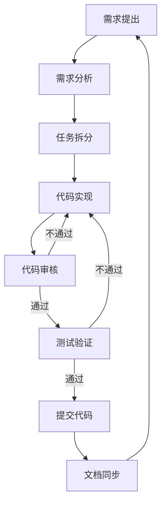
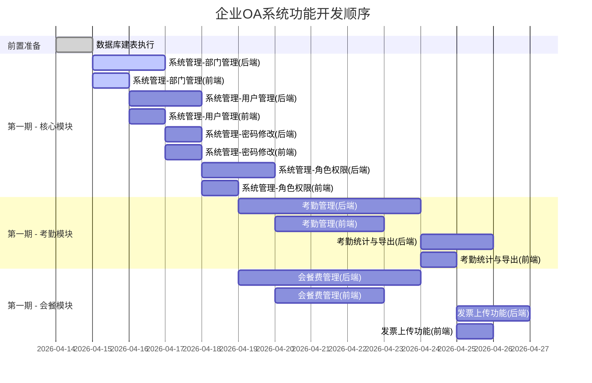
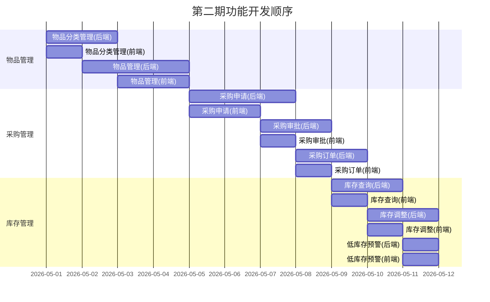
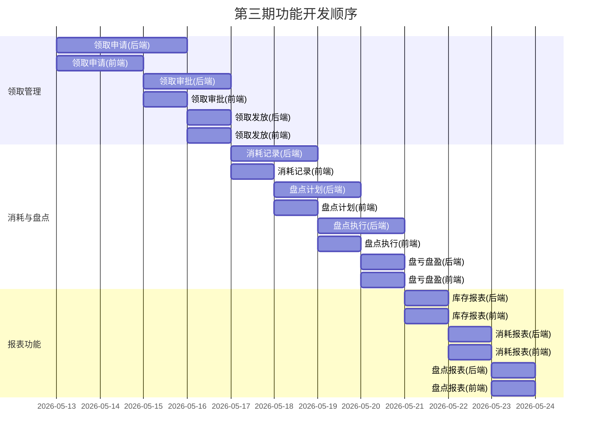
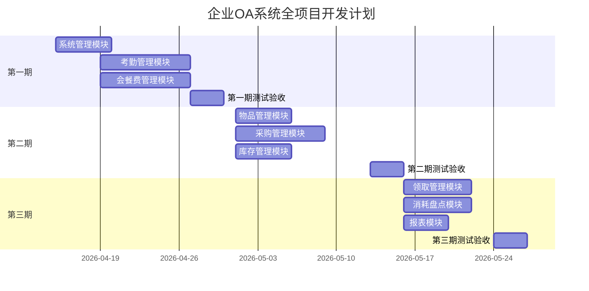

# 企业OA管理系统 - AI驱动开发文档

## 文档信息

| 项目   | 内容         |
| ---- | ---------- |
| 项目名称 | 企业OA管理系统   |
| 项目版本 | V1.0       |
| 文档日期 | 2026-04-14 |
| 开发模式 | AI辅助驱动     |
| 维护人员 | 开发者 + AI助手 |

***

## 1. 项目概述

### 1.1 项目背景

本项目采用AI辅助驱动开发模式，通过与AI助手对话完成需求分析、代码开发、问题解决等任务。开发者负责提出需求和审核结果，AI负责具体实现和问题处理。

### 1.2 AI开发特点

| 特点    | 说明                  |
| ----- | ------------------- |
| 上下文驱动 | 完整保留对话历史和需求上下文      |
| 任务拆分  | 大任务拆分为可执行的子任务       |
| 迭代开发  | 快速原型 → 反馈 → 改进 → 完善 |
| 代码审核  | 开发者审核AI生成的代码        |
| 文档同步  | 代码变更同步更新文档          |

### 1.3 项目范围

| 模块分类 | 功能模块                   | 开发状态  |
| ---- | ---------------------- | ----- |
| 第一期  | 考勤管理、会餐费管理、系统管理、数据字典管理 | ✅ 已完成 |
| 第二期  | 物品管理、采购管理、库存管理         | ⏳ 待开始 |
| 第三期  | 消耗管理、盘点管理、报表功能         | ⏳ 待开始 |

***

## 2. AI开发工作流

### 2.1 开发流程



### 2.2 任务执行模式

1. **需求提出**：开发者描述需求（文字/截图/选中代码）
2. **AI分析**：AI理解需求，拆分任务
3. **任务确认**：开发者确认任务清单
4. **逐步实现**：AI逐个完成任务
5. **即时反馈**：开发者测试并反馈
6. **循环迭代**：直到功能完成

### 2.3 代码审核要点

| 审核项   | 检查内容     | 重要性 |
| ----- | -------- | --- |
| 功能正确性 | 是否实现需求   | ⭐⭐⭐ |
| 代码质量  | 规范、可读性   | ⭐⭐  |
| 安全检查  | 是否有安全漏洞  | ⭐⭐⭐ |
| 性能考虑  | 是否有效率问题  | ⭐⭐  |
| 文档同步  | 是否更新相关文档 | ⭐   |

***

***

## 3. 当前开发进度

### 3.1 整体进度

| 阶段  | 进度   | 说明                                   |
| --- | ---- | ------------------------------------ |
| 第一期 | 100% | 系统管理、考勤管理、会餐费管理、数据字典管理已完成 |
| 第二期 | 0%   | 未开始                                  |
| 第三期 | 0%   | 未开始                                  |
| 整体  | 37%  | -                                    |

### 3.2 已完成模块

#### ✅ 后端框架（2026-04-14）

| 模块            | 文件                          | 状态 |
| ------------- | --------------------------- | -- |
| Spring Boot配置 | pom.xml                     | ✅  |
| 数据库连接         | application.properties      | ✅  |
| 安全配置          | SecurityConfig.java         | ✅  |
| 统一响应          | Result.java                 | ✅  |
| 异常处理          | GlobalExceptionHandler.java | ✅  |
| 业务异常          | BusinessException.java      | ✅  |
| 建表脚本          | schema.sql                  | ✅  |
| 热部署           | DevTools                    | ✅  |

#### ✅ 后端认证（2026-04-14）

| 模块         | 文件                           | 状态 |
| ---------- | ---------------------------- | -- |
| 用户实体       | User.java                    | ✅  |
| JWT工具      | JwtUtils.java                | ✅  |
| JWT过滤器     | JwtAuthenticationFilter.java | ✅  |
| 用户服务       | UserService.java             | ✅  |
| 服务实现       | UserServiceImpl.java         | ✅  |
| 用户Mapper   | UserMapper.java              | ✅  |
| Mapper XML | UserMapper.xml               | ✅  |
| 认证控制器      | AuthController.java          | ✅  |
| DTO/VO     | LoginDTO, LoginVO, UserVO    | ✅  |

#### ✅ 前端框架（2026-04-14）

| 模块      | 文件                           | 状态 |
| ------- | ---------------------------- | -- |
| Vue3项目  | package.json, vite.config.js | ✅  |
| 入口文件    | main.js, App.vue             | ✅  |
| 路由配置    | router/index.js              | ✅  |
| Axios封装 | utils/request.js             | ✅  |
| 状态管理    | stores/user.js               | ✅  |
| 认证API   | api/auth.js                  | ✅  |
| 登录页面    | views/login/LoginView\.vue   | ✅  |
| 主布局     | views/layout/MainLayout.vue  | ✅  |
| 仪表盘     | views/DashboardView\.vue     | ✅  |

#### ✅ 系统管理模块（2026-04-18）

| 模块         | 文件                                      | 状态 |
| ---------- | --------------------------------------- | -- |
| 部门实体       | entity/Department.java                  | ✅  |
| 部门VO       | vo/DepartmentVO.java                    | ✅  |
| 部门Mapper   | mapper/DepartmentMapper.java            | ✅  |
| Mapper XML | resources/mapper/DepartmentMapper.xml   | ✅  |
| 部门服务接口     | service/DepartmentService.java          | ✅  |
| 部门服务实现     | service/impl/DepartmentServiceImpl.java | ✅  |
| 部门控制器      | controller/DepartmentController.java    | ✅  |
| 用户实体       | entity/User.java                        | ✅  |
| 用户Mapper   | mapper/UserMapper.java                  | ✅  |
| Mapper XML | resources/mapper/UserMapper.xml         | ✅  |
| 用户服务接口     | service/UserService.java                | ✅  |
| 用户服务实现     | service/impl/UserServiceImpl.java       | ✅  |
| 用户控制器      | controller/UserController.java          | ✅  |
| DTO        | dto/CreateUserDTO, UpdateUserDTO        | ✅  |
| 前端API      | api/department.js, api/user.js          | ✅  |
| 部门页面       | views/system/DepartmentView\.vue        | ✅  |
| 用户页面       | views/system/UserView\.vue              | ✅  |
| 路由配置       | router/index.js                         | ✅  |

#### ✅ 考勤管理模块（2026-04-18）

| 模块         | 文件                                      | 状态 |
| ---------- | --------------------------------------- | -- |
| 考勤实体       | entity/Attendance.java                  | ✅  |
| 考勤VO       | vo/AttendanceVO.java                    | ✅  |
| 考勤Mapper   | mapper/AttendanceMapper.java            | ✅  |
| Mapper XML | resources/mapper/AttendanceMapper.xml   | ✅  |
| 考勤服务接口     | service/AttendanceService.java          | ✅  |
| 考勤服务实现     | service/impl/AttendanceServiceImpl.java | ✅  |
| 考勤控制器      | controller/AttendanceController.java    | ✅  |
| 前端API      | api/attendance.js                       | ✅  |
| 考勤页面       | views/attendance/AttendanceView\.vue    | ✅  |

#### ✅ 会餐费管理模块（2026-04-18）

| 模块         | 文件                                        | 状态 |
| ---------- | ----------------------------------------- | -- |
| 会餐实体       | entity/DinnerRecord.java                  | ✅  |
| 会餐VO       | vo/DinnerRecordVO.java                    | ✅  |
| 会餐Mapper   | mapper/DinnerRecordMapper.java            | ✅  |
| Mapper XML | resources/mapper/DinnerRecordMapper.xml   | ✅  |
| 会餐服务接口     | service/DinnerRecordService.java          | ✅  |
| 会餐服务实现     | service/impl/DinnerRecordServiceImpl.java | ✅  |
| 会餐控制器      | controller/DinnerRecordController.java    | ✅  |
| 前端API      | api/dinner.js                             | ✅  |
| 会餐页面       | views/dinner/DinnerRecordView\.vue        | ✅  |

#### ✅ 数据字典管理模块（2026-04-18）

| 模块         | 文件                                                                  | 状态 |
| ---------- | ------------------------------------------------------------------- | -- |
| 字典实体       | entity/DictCategory.java, DictItem.java                             | ✅  |
| 字典VO       | vo/DictCategoryVO.java, DictItemVO.java                             | ✅  |
| 字典Mapper   | mapper/DictCategoryMapper.java, DictItemMapper.java                 | ✅  |
| Mapper XML | resources/mapper/DictCategoryMapper.xml, DictItemMapper.xml         | ✅  |
| 字典服务接口     | service/DictCategoryService.java, DictItemService.java              | ✅  |
| 字典服务实现     | service/impl/DictCategoryServiceImpl.java, DictItemServiceImpl.java | ✅  |
| 字典控制器      | controller/DictController.java                                      | ✅  |
| 前端API      | api/dict.js                                                         | ✅  |
| 字典页面       | views/system/DictView\.vue                                          | ✅  |

### 3.3 已完成模块统计

| 模块     | 文件数    | 状态    |
| ------ | ------ | ----- |
| 后端框架   | 9      | ✅     |
| 后端认证   | 9      | ✅     |
| 前端框架   | 9      | ✅     |
| 系统管理   | 18     | ✅     |
| 考勤管理   | 9      | ✅     |
| 会餐费管理  | 9      | ✅     |
| 数据字典管理 | 9      | ✅     |
| **总计** | **72** | **✅** |

### 3.4 待开发模块

#### ⏳ 第二期待开发

物品管理、采购管理、库存管理

#### ⏳ 第三期待开发

领取管理、消耗管理、盘点管理、报表功能

（详细任务清单见 4.3-4.6 节）

### 3.4 待开发模块

#### ⏳ 第二期待开发

物品管理、采购管理、库存管理

#### ⏳ 第三期待开发

领取管理、消耗管理、盘点管理、报表功能

（详细任务清单见 4.3-4.6 节）

***

## 4. 项目开发顺序

### 4.1 开发顺序总览



### 4.2 开发任务清单

#### ✅ 第一期 - 系统管理模块（已完成）

| 序号 | 任务          | 前后依赖 | 可并行    | 优先级 | 状态 |
| -- | ----------- | ---- | ------ | --- | -- |
| 1  | 部门管理-后端CRUD | -    | -      | P0  | ✅  |
| 2  | 部门管理-前端页面   | 1    | -      | P0  | ✅  |
| 3  | 用户管理-后端CRUD | -    | 1,2可并行 | P0  | ✅  |
| 4  | 用户管理-前端页面   | 3    | -      | P0  | ✅  |
| 5  | 密码修改-后端API  | 3    | -      | P0  | ✅  |
| 6  | 密码修改-前端页面   | 5    | -      | P0  | ✅  |
| 7  | 角色权限-后端实现   | 3    | -      | P0  | ✅  |
| 8  | 角色权限-前端实现   | 7    | -      | P0  | ✅  |

#### ✅ 第一期 - 考勤管理模块（已完成）

| 序号 | 任务           | 前后依赖 | 可并行      | 优先级 | 状态 |
| -- | ------------ | ---- | -------- | --- | -- |
| 9  | 考勤日历-后端API   | -    | 可与系统管理并行 | P0  | ✅  |
| 10 | 考勤日历-前端展示    | 9    | -        | P0  | ✅  |
| 11 | 考勤状态标记-后端    | 9    | 可与10并行   | P0  | ✅  |
| 12 | 考勤状态标记-前端    | 11   | -        | P0  | ✅  |
| 13 | 考勤录入/修改-后端   | 9    | 可与11并行   | P0  | ✅  |
| 14 | 考勤录入/修改-前端   | 13   | -        | P0  | ✅  |
| 15 | 法定节假日-后端     | 9    | 可与11并行   | P0  | ✅  |
| 16 | 法定节假日-前端     | 15   | -        | P0  | ✅  |
| 17 | 考勤统计-后端      | 9    | 可与11并行   | P0  | ✅  |
| 18 | 考勤统计-前端      | 17   | -        | P0  | ✅  |
| 19 | 考勤导出Excel-后端 | 9    | 可与17并行   | P0  | ✅  |
| 20 | 考勤导出Excel-前端 | 19   | -        | P0  | ✅  |
| 21 | 查看所有考勤-后端    | 9    | 可与11并行   | P1  | ✅  |
| 22 | 查看所有考勤-前端    | 21   | -        | P1  | ✅  |

#### ✅ 第一期 - 会餐费管理模块（已完成）

| 序号 | 任务          | 前后依赖 | 可并行      | 优先级 | 状态 |
| -- | ----------- | ---- | -------- | --- | -- |
| 23 | 会餐记录CRUD-后端 | -    | 可与系统管理并行 | P0  | ✅  |
| 24 | 会餐记录CRUD-前端 | 23   | -        | P0  | ✅  |
| 25 | 列表排序-后端     | 23   | 可与24并行   | P0  | ✅  |
| 26 | 列表排序-前端     | 25   | -        | P0  | ✅  |
| 27 | 日期金额搜索-后端   | 23   | 可与25并行   | P0  | ✅  |
| 28 | 日期金额搜索-前端   | 27   | -        | P0  | ✅  |
| 29 | 统计信息-后端     | 23   | 可与25并行   | P0  | ✅  |
| 30 | 统计信息-前端     | 29   | -        | P0  | ✅  |
| 31 | 发票上传-后端     | 23   | 可与25并行   | P1  | ✅  |
| 32 | 发票上传-前端     | 31   | -        | P1  | ✅  |

#### ✅ 第一期 - 数据字典管理模块（已完成）

| 序号 | 任务            | 前后依赖 | 可并行        | 优先级 | 状态 |
| -- | ------------- | ---- | ---------- | --- | -- |
| 33 | 字典分类-后端CRUD   | -    | 可与系统管理并行 | P1  | ✅  |
| 34 | 字典分类-前端展示    | 33   | -          | P1  | ✅  |
| 35 | 字典项-后端CRUD   | 33   | 可与34并行     | P0  | ✅  |
| 36 | 字典项-前端展示     | 35   | -          | P0  | ✅  |
| 37 | 字典项-新增/编辑弹窗  | 35   | 可与36并行     | P0  | ✅  |
| 38 | 字典项-搜索功能    | 35   | 可与36并行     | P1  | ✅  |
| 39 | 字典项-启用/禁用   | 35   | 可与36并行     | P0  | ✅  |
| 40 | 字典缓存-后端实现   | 33   | 可与其他并行    | P1  | ✅  |

### 4.3 并行开发说明

#### 可并行任务组合

| 组合  | 任务A     | 任务B      | 说明          |
| --- | ------- | -------- | ----------- |
| 组合1 | 系统管理-后端 | 会餐费管理-后端 | 各自独立模块      |
| 组合2 | 系统管理-前端 | 会餐费管理-前端 | 各自独立模块      |
| 组合3 | 系统管理-后端 | 考勤管理-后端  | 各自独立模块      |
| 组合4 | 考勤管理-后端 | 会餐费管理-后端 | 各自独立模块      |
| 组合5 | 部门管理    | 用户管理     | 后端可并行，前端需串行 |
| 组合6 | CRUD后端  | CRUD前端   | 后端先于前端1天    |

#### 推荐开发顺序（单开发者）

```
第1天：部门管理后端 + 前端
第2天：用户管理后端
第3天：用户管理前端 + 密码修改
第4天：密码修改前端 + 角色权限后端
第5天：角色权限前端 + 考勤管理后端（开始）
第6天：考勤管理前端
第7天：考勤状态后端 + 会餐费后端（并行）
第8天：考勤录入 + 会餐前端
第9天：考勤统计 + 会餐CRUD
第10天：考勤导出 + 会餐搜索
第11天：考勤前端完善 + 会餐统计
第12天：会餐发票 + 整合测试
第13-14天：测试验收
```

#### 推荐开发顺序（双开发者）

```
开发者A：                    开发者B：
第1天：部门管理后端          第1天：会餐费后端
第2天：部门管理前端          第2天：会餐费前端
第3天：用户管理后端          第3天：考勤管理后端
第4天：用户管理前端          第4天：考勤管理前端
第5天：密码修改后端          第5天：考勤状态后端
第6天：密码修改前端          第6天：考勤录入后端
第7天：角色权限后端          第7天：考勤录入前端
第8天：角色权限前端          第8天：考勤统计后端
第9天：整合协调              第9天：考勤统计前端
第10天：会餐发票后端          第10天：考勤导出后端
第11天：会餐发票前端          第11天：考勤导出前端
第12天：整合测试              第12天：整合测试
第13-14天：测试验收          第13-14天：测试验收
```

### 4.4 任务优先级说明

| 优先级 | 说明         | 任务范围                        |
| --- | ---------- | --------------------------- |
| P0  | 核心功能，必须完成  | 系统管理、考勤CRUD、会餐CRUD、数据字典CRUD |
| P1  | 重要功能，尽量完成  | 考勤导出、发票上传、查看所有考勤、字典缓存       |
| P2  | 扩展功能，有时间再做 | 字典导入导出、字典项排序                |

### 4.5 第二期开发任务（预计12天）



#### 🔧 第二期 - 物品管理模块（预计5天）

| 序号 | 任务          | 前后依赖 | 可并行   | 优先级 | 状态 |
| -- | ----------- | ---- | ----- | --- | -- |
| 1  | 物品分类CRUD-后端 | -    | -     | P0  | ⏳  |
| 2  | 物品分类CRUD-前端 | 1    | -     | P0  | ⏳  |
| 3  | 物品CRUD-后端   | -    | 1可并行  | P0  | ⏳  |
| 4  | 物品CRUD-前端   | 3    | -     | P0  | ⏳  |
| 5  | 物品列表搜索-后端   | 3    | 可与4并行 | P0  | ⏳  |
| 6  | 物品列表搜索-前端   | 5    | -     | P0  | ⏳  |

#### 🔧 第二期 - 采购管理模块（预计8天）

| 序号 | 任务      | 前后依赖 | 可并行      | 优先级 | 状态 |
| -- | ------- | ---- | -------- | --- | -- |
| 7  | 采购申请-后端 | -    | 可与物品管理并行 | P0  | ⏳  |
| 8  | 采购申请-前端 | 7    | -        | P0  | ⏳  |
| 9  | 采购审批-后端 | 7    | 可与8并行    | P0  | ⏳  |
| 10 | 采购审批-前端 | 9    | -        | P0  | ⏳  |
| 11 | 采购订单-后端 | 7    | 可与9并行    | P0  | ⏳  |
| 12 | 采购订单-前端 | 11   | -        | P0  | ⏳  |

#### 🔧 第二期 - 库存管理模块（预计5天）

| 序号 | 任务       | 前后依赖 | 可并行      | 优先级 | 状态 |
| -- | -------- | ---- | -------- | --- | -- |
| 13 | 库存查询-后端  | -    | 可与采购管理并行 | P0  | ⏳  |
| 14 | 库存查询-前端  | 13   | -        | P0  | ⏳  |
| 15 | 库存调整-后端  | 13   | 可与14并行   | P0  | ⏳  |
| 16 | 库存调整-前端  | 15   | -        | P0  | ⏳  |
| 17 | 低库存预警-后端 | 13   | 可与15并行   | P1  | ⏳  |
| 18 | 低库存预警-前端 | 17   | -        | P1  | ⏳  |

### 4.6 第三期开发任务（预计10天）



#### 🔧 第三期 - 领取管理模块（预计6天）

| 序号 | 任务      | 前后依赖 | 可并行   | 优先级 | 状态 |
| -- | ------- | ---- | ----- | --- | -- |
| 1  | 领取申请-后端 | -    | -     | P0  | ⏳  |
| 2  | 领取申请-前端 | 1    | -     | P0  | ⏳  |
| 3  | 领取审批-后端 | 1    | 可与2并行 | P0  | ⏳  |
| 4  | 领取审批-前端 | 3    | -     | P0  | ⏳  |
| 5  | 领取发放-后端 | 3    | 可与4并行 | P0  | ⏳  |
| 6  | 领取发放-前端 | 5    | -     | P0  | ⏳  |

#### 🔧 第三期 - 消耗与盘点模块（预计6天）

| 序号 | 任务        | 前后依赖 | 可并行      | 优先级 | 状态 |
| -- | --------- | ---- | -------- | --- | -- |
| 7  | 消耗记录-后端   | -    | 可与领取管理并行 | P0  | ⏳  |
| 8  | 消耗记录-前端   | 7    | -        | P0  | ⏳  |
| 9  | 盘点计划-后端   | -    | 可与消耗并行   | P0  | ⏳  |
| 10 | 盘点计划-前端   | 9    | -        | P0  | ⏳  |
| 11 | 盘点执行-后端   | 9    | 可与10并行   | P0  | ⏳  |
| 12 | 盘点执行-前端   | 11   | -        | P0  | ⏳  |
| 13 | 盘亏盘盈处理-后端 | 11   | 可与12并行   | P0  | ⏳  |
| 14 | 盘亏盘盈处理-前端 | 13   | -        | P0  | ⏳  |

#### 🔧 第三期 - 报表模块（预计4天）

| 序号 | 任务      | 前后依赖 | 可并行      | 优先级 | 状态 |
| -- | ------- | ---- | -------- | --- | -- |
| 15 | 库存报表-后端 | -    | 可与盘点并行   | P1  | ⏳  |
| 16 | 库存报表-前端 | 15   | -        | P1  | ⏳  |
| 17 | 消耗报表-后端 | -    | 可与库存报表并行 | P1  | ⏳  |
| 18 | 消耗报表-前端 | 17   | -        | P1  | ⏳  |
| 19 | 盘点报表-后端 | -    | 可与消耗报表并行 | P1  | ⏳  |
| 20 | 盘点报表-前端 | 19   | -        | P1  | ⏳  |

### 4.7 全项目开发总览

| 阶段     | 预计时间    | 核心任务数   | 可并行模块        |
| ------ | ------- | ------- | ------------ |
| 第一期    | 14天     | 32个     | 系统管理、考勤、会餐费  |
| 第二期    | 12天     | 18个     | 物品管理、采购、库存   |
| 第三期    | 10天     | 20个     | 领取管理、消耗盘点、报表 |
| **总计** | **36天** | **70个** | -            |

### 4.8 全项目甘特图



## 5. AI对话历史

### 5.1 已完成的主要对话

| 日期         | 对话主题   | 输出物          | 状态 |
| ---------- | ------ | ------------ | -- |
| 2026-04-11 | 需求分析整合 | 综合需求文档.md    | ✅  |
| 2026-04-14 | 后端框架搭建 | pom.xml, 配置类 | ✅  |
| 2026-04-14 | 数据库设计  | schema.sql   | ✅  |
| 2026-04-14 | 后端认证模块 | UserService等 | ✅  |
| 2026-04-14 | 前端框架搭建 | Vue3项目       | ✅  |
| 2026-04-14 | UI风格优化 | 商务风格组件       | ✅  |
| 2026-04-14 | 项目管理文档 | 本文档          | ✅  |

### 5.2 问题记录与解决

| 问题               | 解决方案               | 日期         |
| ---------------- | ------------------ | ---------- |
| pom.xml jjwt依赖红线 | 使用版本变量管理           | 2026-04-14 |
| 前端request路径错误    | 修正为@/utils/request | 2026-04-14 |
| logo.png文件缺失     | 改用图标替代             | 2026-04-14 |
| 密码加密方式           | 改为明文验证             | 2026-04-14 |

***

## 6. 代码规范（AI开发版）

### 6.1 AI生成代码要求

#### 必须遵循

| 规范   | 说明            |
| ---- | ------------- |
| 中文注释 | 代码使用中文注释      |
| 变量命名 | 英文命名 + 中文注释说明 |
| 错误处理 | 必须有异常处理逻辑     |
| 日志记录 | 关键操作需记录日志     |
| 提交信息 | 使用中文提交信息      |

#### 推荐实践

| 实践   | 说明            |
| ---- | ------------- |
| 增量开发 | 先实现核心功能，再完善细节 |
| 随时测试 | 每完成一个小功能就测试   |
| 文档同步 | 代码变更后更新相关文档   |
| 代码可逆 | 保持代码易于回滚      |

### 6.2 Git提交规范

```
feat: 新功能
fix: 修复bug
docs: 文档更新
style: 代码格式
refactor: 重构
test: 测试相关
chore: 构建/工具
```

**示例**：

```bash
git commit -m "feat: 添加用户登录API"
git commit -m "fix: 修复登录密码验证问题"
git commit -m "docs: 更新项目管理文档"
```

### 6.3 文件命名规范

| 类型     | 规范          | 示例               |
| ------ | ----------- | ---------------- |
| Java类  | PascalCase  | UserService.java |
| Java变量 | camelCase   | userName         |
| 前端组件   | PascalCase  | LoginView\.vue   |
| 前端变量   | camelCase   | userName         |
| 数据库表   | snake\_case | sys\_user        |
| 数据库字段  | snake\_case | user\_name       |

***

## 7. 上下文管理

### 7.1 关键上下文文件

| 文件        | 作用     | 更新频率  |
| --------- | ------ | ----- |
| 综合需求文档.md | 需求来源   | 需求变更时 |
| 项目管理文档.md | 进度跟踪   | 每次迭代后 |
| 代码注释      | 具体实现细节 | 实现时   |

### 7.2 AI上下文维护

当开始新的开发会话时，需要向AI提供以下上下文：

```
## 当前项目状态
- 开发阶段：第一期
- 技术栈：Spring Boot 3.5.13 + Vue3
- 数据库：MySQL 8.0

## 最近完成的工作
- [列出最近3-5个已完成的任务]

## 当前任务
- [描述正在进行的任务]

## 需要注意的问题
- [列出已知的限制或注意事项]
```

### 7.3 需求追溯

| 需求ID    | 来源文档      | 实现位置 | 状态  |
| ------- | --------- | ---- | --- |
| ATT-001 | 综合需求文档.md | -    | ⏳   |
| SYS-001 | 综合需求文档.md | -    | ⏳   |
| ...     | ...       | ...  | ... |

***

## 8. 技术栈详情

### 8.1 后端技术栈

| 技术              | 版本     | 用途      | 状态 |
| --------------- | ------ | ------- | -- |
| Spring Boot     | 3.5.13 | 核心框架    | ✅  |
| Spring Security | 6.x    | 安全框架    | ✅  |
| MyBatis         | 3.0.5  | ORM框架   | ✅  |
| MySQL           | 8.0    | 数据库     | ✅  |
| Druid           | 1.2.21 | 连接池     | ✅  |
| JWT             | 0.12.5 | Token认证 | ✅  |
| PageHelper      | 2.1.0  | 分页插件    | ✅  |
| Lombok          | 1.18.x | 简化代码    | ✅  |

### 8.2 前端技术栈

| 技术           | 版本    | 用途     | 状态 |
| ------------ | ----- | ------ | -- |
| Vue          | 3.4.x | 前端框架   | ✅  |
| Vite         | 5.x   | 构建工具   | ✅  |
| Vue Router   | 4.x   | 路由管理   | ✅  |
| Pinia        | 2.x   | 状态管理   | ✅  |
| Axios        | 1.x   | HTTP请求 | ✅  |
| Element Plus | 2.x   | UI组件库  | ✅  |

### 8.3 开发工具

| 工具       | 用途     | 备注     |
| -------- | ------ | ------ |
| Trae IDE | AI开发环境 | 主要开发工具 |
| Git      | 版本控制   | 代码管理   |
| MySQL    | 数据库    | 远程服务器  |
| Postman  | API测试  | 接口调试   |

***

## 9. 数据库配置

### 9.1 连接信息

| 配置项   | 值                  |
| ----- | ------------------ |
| 数据库类型 | MySQL 8.0          |
| 地址    | 8.140.210.133:3306 |
| 数据库名  | enterprise\_oa     |
| 用户名   | root               |
| 字符集   | utf8mb4            |

### 9.2 数据表清单

| 序号 | 表名                    | 说明     | 状态 |
| -- | --------------------- | ------ | -- |
| 1  | department            | 部门表    | ✅  |
| 2  | sys\_user             | 用户表    | ✅  |
| 3  | attendance            | 考勤表    | ✅  |
| 4  | dinner\_record        | 会餐费记录表 | ✅  |
| 5  | item\_category        | 物品分类表  | ✅  |
| 6  | item                  | 物品表    | ✅  |
| 7  | purchase\_request     | 采购申请表  | ✅  |
| 8  | purchase\_order       | 采购订单表  | ✅  |
| 9  | inventory             | 库存表    | ✅  |
| 10 | inventory\_adjustment | 库存调整表  | ✅  |
| 11 | claim\_request        | 领取申请表  | ✅  |
| 12 | claim\_record         | 领取记录表  | ✅  |
| 13 | consumption\_record   | 消耗记录表  | ✅  |
| 14 | check\_plan           | 盘点计划表  | ✅  |
| 15 | check\_record         | 盘点明细表  | ✅  |

***

## 10. 项目结构

### 10.1 后端结构

```
backend/
├── src/main/java/com/oa/generalos/
│   ├── GeneralosApplication.java    # 主类
│   ├── config/                     # 配置类
│   │   └── SecurityConfig.java
│   ├── controller/                  # 控制器
│   │   └── AuthController.java
│   ├── service/                    # 服务层
│   │   ├── UserService.java
│   │   └── impl/
│   ├── mapper/                     # Mapper层
│   │   └── UserMapper.java
│   ├── entity/                     # 实体类
│   │   └── User.java
│   ├── dto/                        # 数据传输对象
│   ├── vo/                         # 视图对象
│   ├── security/                   # 安全相关
│   │   └── JwtAuthenticationFilter.java
│   ├── utils/                      # 工具类
│   │   └── JwtUtils.java
│   ├── exception/                   # 异常处理
│   │   ├── BusinessException.java
│   │   └── GlobalExceptionHandler.java
│   └── common/                     # 公共类
│       └── Result.java
├── src/main/resources/
│   ├── application.properties      # 配置文件
│   ├── schema.sql                  # 建表脚本
│   └── mapper/                     # Mapper XML
│       └── UserMapper.xml
└── pom.xml
```

### 10.2 前端结构

```
frontend/
├── src/
│   ├── main.js                     # 入口文件
│   ├── App.vue                     # 根组件
│   ├── api/                        # API接口
│   │   └── auth.js
│   ├── assets/                     # 静态资源
│   ├── components/                 # 公共组件
│   ├── router/                     # 路由配置
│   │   └── index.js
│   ├── stores/                     # 状态管理
│   │   └── user.js
│   ├── utils/                      # 工具函数
│   │   └── request.js
│   └── views/                      # 页面视图
│       ├── login/
│       │   └── LoginView.vue
│       ├── layout/
│       │   └── MainLayout.vue
│       └── DashboardView.vue
├── package.json
├── vite.config.js
└── index.html
```

***

## 11. 测试账号

### 11.1 默认用户

| 用户名     | 密码 | 角色    | 部门   |
| ------- | -- | ----- | ---- |
| admin   | 1  | 系统管理员 | 行政部门 |
| manager | 1  | 部门主管  | 行政部门 |
| user1   | 1  | 普通员工  | 行政部门 |
| finance | 1  | 财务人员  | 财务部  |

***

## 12. 变更记录

| 日期         | 版本   | 变更内容   | 开发者  |
| ---------- | ---- | ------ | ---- |
| 2026-04-14 | V1.0 | 初始版本创建 | AI辅助 |
| 2026-04-14 | V1.0 | 添加后端框架 | AI辅助 |
| 2026-04-14 | V1.0 | 添加认证模块 | AI辅助 |
| 2026-04-14 | V1.0 | 添加前端框架 | AI辅助 |
| 2026-04-14 | V1.0 | UI风格优化 | AI辅助 |

